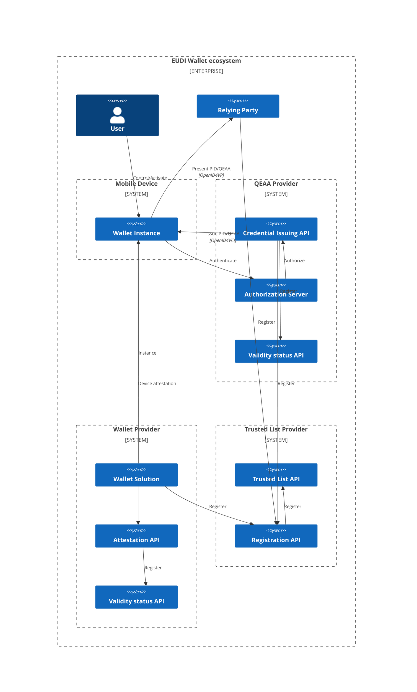

```mermaid
C4Context
    Enterprise_Boundary(eudi, "EUDI Wallet ecosystem") {
        Person(u, "User")

        System_Boundary(md, "Mobile Device") {
            System(wi, "Wallet Instance")
        }
        System_Boundary(qp, "QEAA Provider") {
            System(qi, "Credential Issuing API")
            System(as, "Authorization Server")
            System(qv, "Validity status API")
        }
        System_Boundary(wp, "Wallet Provider") {
            System(ws, "Wallet Solution")
            System(was, "Attestation API")
            System(wsv, "Validity status API")
        }
        System(rp, "Relying Party")
        System_Boundary(tlr, "Trusted List Provider") {
            System(tl, "Trusted List API")
            System(tlr, "Registration API")
        }
    }
    Rel(u, wi, "Control/Activate")
    Rel(ws, wi, "Instance")
    Rel(tlr, tl, "Register")
    Rel(qi, tlr, "Register")
    Rel(ws, tlr, "Register")
    Rel(rp, tlr, "Register")
    Rel(as, qi, "Authorize")
    Rel(wi, as, "Authenticate")
    Rel(wi, was, "Device attestation")
    Rel(was, wsv, "Register")
    Rel(qi, qv, "Register")
    Rel(qi, wi, "Issue PID/QEAA", "OpenID4VCI")
    Rel(wi, rp, "Present PID/QEAA", "OpenID4VP")
    
```
