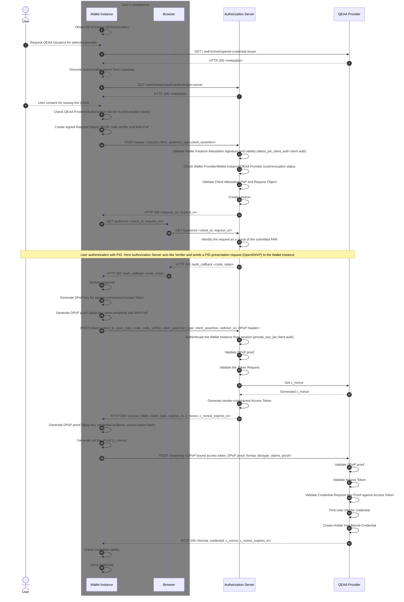

[OpenID for Verifiable Credential Issuance][OpenID4VCI] specification defines an API that is used to
issue verifiable credentials. Verifiable Credentials are very similar to identity assertions, like ID Tokens in [OpenID
Connect][OpenID.Core], in that they allow a Credential Issuer to assert End-User claims. However, in
contrast to the identity assertions, a verifiable credential follows a pre-defined schema (the Credential type) and is
bound to a certain holder, e.g trough cryptographic holder binding. This allows secure direct presentation of the
Credential from the End-User to the Relying Party (RP), **without involvement of the Credential Issuer.**

1. The QEAA's are issued according to [OpenID4VCI] protocol.
2. It is based on the [Authorization Code Flow][RFC 6749] with [Pushed Authorization Requests][RFC 9126]
   and [Proof Key for Code Exchange (PKCE)][RFC 7636] as recommended in [OpenID4VCI], Section 3.4.
3. It uses sender-constrained access tokens by [Demonstrating Proof of Possession (DPoP)][RFC 9449].
4. It uses `attest_jwt_client_auth` Client Authentication
   method ([OAuth 2.0 Attestation-Based Client Authentication][attestation-based-client-auth]) in PAR Endpoint.
5. It uses `private_key_jwt` Client Authentication method ([RFC 7523],[RFC 7521]) in Token Endpoint.

### Issuance Flow

The flow is **Wallet Initiated** and the User receives the QEAA directly in response to the Credential Request
(Immediate Flow).

---
**Step 1 (Trusted list of QEAA providers).**

- Obtain list of trusted QEAA providers. The exact methods to obtain list of trusted parties are still under discussion
  in [EUDI-ARF].

---
**Step 2 (Issuance Request).**

- User selects which credential to request.

---
**Steps 3-7 (Discovery).**

- Wallet Instance `SHALL` request QEAA Provider metadata and use `authorization_server` claim to request Authorization
  Server metadata. The metadata contains technical information about the Issuer and translations/display data for the
  offered credentials.
- It `MUST` check if the QEAA Provider/Authorization Server are trusted and not revoked. The exact methods to attest
  trust and validity are still under discussion in [EUDI-ARF].

---
**Step 8 (Consent).**

- The Wallet shows information about the QEAA Provider and the offered QEAA to the user and asks for consent.

**Step 9 (Provider trust).**

- The Wallet checks QEAA Provider/Authorization Server trust/revocation status.

---
**Steps 10-11 (PAR Request).**

- The Wallet Instance `MUST` create a fresh [PKCE][RFC 7636] `code_verifier` and derive `code_challenge` from it to
  exchange the authorization code for the access token later on with `code_verifier`.
- It `MUST` use the `request` parameter (`Request Object`) as defined in [RFC 9126] Section 3.
- `Request Object` is a [JWT-Secured Authorization Request (JAR)][RFC 9101] and it `MUST` be signed by the private
  key defined in Wallet Instance Attestation `cnf` claim.
- It `MUST` include all request parameters as claims of the `Request Object` except `client_assertion`
  and `client_assertion_type` as specified in PAR Request Object.
- PAR Endpoint is a protected endpoint. The Client Authentication is based on the model defined
  in [OAuth 2.0 Attestation-Based Client Authentication][attestation-based-client-auth] using the WIA
  as `Client Attestation JWT` and `Client Attestation PoP JWT` (WIA-PoP), signed by a key defined in a WIA `cnf` claim,
  inside
  the `client_assertion` parameter and `urn:ietf:params:oauth:client-assertion-type:jwt-client-attestation`
  as `client_assertion_type`.
- The `authorization_details`, as defined in [RFC 9396], parameter `MUST` be used (as required by [OpenID4VCI]) and is
  extended to allow
  Wallet Instance to specify the types of the credentials required when requesting authorization for the QEAA
  issuance.

---
**Steps 12-16 (PAR Response).**

- The Authorization Server performs `REQUIRED` validation checks as described in PAR Validation Steps section. In
  summary:
    - It `MUST` authenticate the Wallet Instance.
    - It `MUST` request Wallet Provider/Wallet Instance/QEAA Provider revocation states.
    - It `MUST` validate the `Request Object`.
- The Authorization Server `MUST` create a new `session` related to `client_id`.
- Authorization Server `MUST` generate the `request_uri` representing a new authorization request and bind it to the
  `client_id` for one-time use.

---
**Steps 17-19 (Authorization Request).**

- The Wallet Instance sends an authorization request to the Authorization Endpoint.
- The Authorization Server performs `REQUIRED` validation checks as described in Authorization Request Validation Steps.
  In short:
    - It `MUST` identify the request as a result of the submitted PAR.
    - It `MUST` prevent replay of the authorization request.

**User Authentication.**

- Authorization Server `MUST` authenticate user by performing Dynamic Credential Request ([OpenID4VCI]), to obtain PID
  Verifiable Credential from Wallet Instance using [OpenID4VP] protocol.
- The Wallet Instance `MUST` have a valid PID obtained prior to starting a transaction with the Authorization Server.

---
**Steps 20-22 (Authorization Response).**

- The Authorization Server sends an authorization `code` together with `state` and `iss` parameters to the Wallet
  Instance `redirect_uri`.
- The Wallet Instance performs `REQUIRED` validation checks as described in Authorization Response Validation Steps.

---
**Steps 23-24 (DPoP Proof for Token Endpoint).**

- The Wallet Instance `MUST` create a new key pair for the DPoP and a fresh DPoP Proof JWT following the instruction
  provided in Section 4 of [RFC 9449] for the Token Endpoint.
- The DPoP Proof JWT `MUST` be signed by Wallet Instance using the newly created private key for DPoP, this provides a
  way to bind the Access Token to a certain sender (Wallet Instance) and mitigates the misuse of leaked or stolen Access
  Tokens at the QEAA Provider Credential Endpoint as the attacker needs to present a valid DPoP Proof JWT.

---
**Step 25 (Token Request with DPoP proof).**

- The Wallet Instance sends a token request to the Token Endpoint using the authorization `code`, `code_verifier`, DPoP
  Proof JWT and `private_key_jwt` parameters (`client_assertion_type` and `client_assertion`).
- The Client Authentication is based on the model defined
  in [OAuth 2.0 Attestation-Based Client Authentication][attestation-based-client-auth] using the WIA
  as `Client Attestation JWT` and `Client Attestation PoP JWT` (WIA-PoP), signed by a key defined in a WIA `cnf` claim,
  inside
  the `client_assertion` parameter and `urn:ietf:params:oauth:client-assertion-type:jwt-client-attestation`
  as `client_assertion_type`.

---
**Steps 26-28 (Token Request Validation).**

- The Authorization Server performs `REQUIRED` validation checks as described in Token Request Validation Steps. In
  summary:
    - It `MUST` authenticate the Wallet Instance by validating `client_assertion` against WIA provided in PAR request.
    - It `MUST` validate the DPoP proof for Token Endpoint.
    - It `MUST` validate the `Token Request`.

---
**Step 29-32 (Token Response).**

- Due to the Requirement 11 the `c_nonce` has to be requested from QEAA Issuer Nonce Endpoint or alternately not be
  returned by Token Endpoint and instead acquired from Credential endpoint error response as described in [OpenID4VCI].
- If the validation is successful, it `MUST` issue an `Access Token` bound to the DPoP key and a `c_nonce`, that is
  used to create a proof of possession of key material when requesting a Credential Endpoint.

---
**Step 33-34 (Proofs for Credential Endpoint).**

- The Wallet Instance `MUST` create a new `DPoP proof` for the Credential Endpoint and Access Token Hash.
- It `MUST` create `jwt Key Proof` for key, that will be bound to issued credential, as described in Credential Request.

---
**Step 35 (Credential request).**

- The Wallet Instance requests a QEAA issuance.
- The request `MUST` contain the sender-constrained `Access Token` in the `Authorization` header as described
  in [RFC 9449].
- The request `MUST` contain `DPoP Proof JWT` with `ath` claim in the `DPoP` header as described
  in [RFC 9449]
- The request `MUST` contain `jwt Key Proof` with `c_nonce` value in `nonce` claim as `proof` parameter and
  the `format`, `doctype`, `claims` parameters as described in Credential Request parameters.

---
**Steps 36-38 (Credential request validation).**

- The QEAA Provider performs `REQUIRED` validation checks as described in Credential Request Validation Steps. In
  summary:
    - It `MUST` validate the DPoP proof for Credential Endpoint/Access Token Hash.
    - It `MUST` validate the sender-constrained `Access Token`.
    - It `MUST` validate the `jwt Key Proof`.

---
**Steps 39-40 (Credential issuance).**

- The QEAA Provider `SHALL` find required data for credential using Access Token `sub` claim.
- It `MUST` issue credential in the format requested by client in the `doctype` and `format` parameters.
- It `MUST` must use `jwt Key Proof` type to bind the Issued Credential to the Identifier (Public Key) of the End-User
  Possessing
  that Credential (Wallet Instance).

---
**Step 41-42 (Credential Response).**

- The Wallet Instance performs `REQUIRED` validation checks as described in Credential Response Validation Steps.

---
**Step 43 (Credential Storage).**

- Wallet Instance stores the credential.

#### Updating Issued Credentials

To update issued credential Wallet Instance `MUST` use the `c_nonce` returned by Credential Endpoint in step 37
and perform steps 29-39. It `MUST` do this before `c_nonce_expires_in` and Access Token `exp` claim or perform
the credential issuance from beginning.
