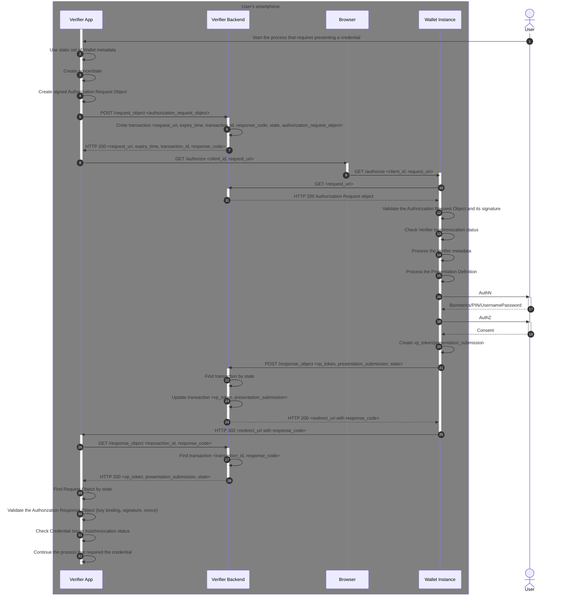

This section describes how a Relying Party (RP), acting as a Verifier, can request a Wallet Instance for presentation of
the QEAA verifiable credentials.

Verifier is an entity that requests, receives, and validates Verifiable Presentations. During presentation of
Credentials, Verifier acts as an OAuth 2.0 Client towards the Wallet that is acting as an OAuth 2.0 Authorization
Server. The Verifier is a specific case of OAuth 2.0 Client, just like Relying Party in [OpenID.Core].

[OpenID4VP] specification defines a mechanism on top of OAuth 2.0 to request and present Verifiable Credentials as
Verifiable Presentations.

As the primary extension, [OpenID4VP] introduces the VP Token as a container to enable End-Users to present Verifiable
Presentations to Verifiers using the Wallet. A VP Token contains one or more Verifiable Presentations in the same or
different Credential formats.

> Current implementation scope does not require Wallet Instance to be authenticated to Relying Party (Verifier).

**Considered use cases**

1. Native iOS/Android mDL consumer application requesting mDL presentation in same-device flow.

<a id="vp-wallet-metadata"></a>
### Wallet Metadata

1. Wallet Provider `SHALL` provide domain-bound iOS Universal Link/Android App link for Wallet Invocation in
   `https://<wallet-provider-domain>/.well-known/apple-app-site-association`
   and `https://<wallet-provider-domain>/.well-known/assetlinks.json` accordingly.
2. The Verifier `SHALL` use the following static set of Wallet metadata:

```json
{
  "authorization_endpoint": "https://<wallet-provider-domain>/authorize",
  "client_id_schemes_supported": [
    "x509_san_dns"
  ],
  "presentation_definition_uri_supported": false,
  "request_object_signing_alg_values_supported": [
    "ES256"
  ],
  "response_types_supported": [
    "vp_token"
  ],
  "response_modes_supported": [
    "direct_post"
  ],
  "request_uri_parameter_supported": true,
  "request_parameter_supported": false,
  "vp_formats_supported": {
    "mso_mdoc": {
      "alg_values_supported": [
        "ES256"
      ]
    }
  }
}
```

<a id="vp-presentation-flow"></a>
### Presentation Flow

The Presentation Flow uses the Response Mode `direct_post` that allows the Wallet to send the Authorization Response to
an endpoint controlled by the Verifier via an HTTPS POST request. The [OpenID4VP] Section 11.5 leaves the exact
implementation up to the Verifier. This document implements modified version of the flow specified in [OpenID4VP]
Section 11.5 that adds Verifier Request Object Endpoint that initiates the transaction instead.



---
**Step 1 (Presentation flow start).**

- User (or the Verifier application) starts the process that requires credential presentation.

---
**Steps 2-4 (Authorization Request).**

- The Verifier `MUST` use the static set of [Wallet metadata](#vp-wallet-metadata) to determine Credential formats,
  proof types and algorithms supported by the Wallet to be used in a protocol exchange.
- It `MUST` create a fresh `nonce` with sufficient entropy to securely bind the Verifiable Presentation(s) provided by
  the Wallet to the particular transaction.
- It `MUST` create a `state` to link Authorization Request to Authorization Response.
- It `MUST` create a [JWT-Secured Authorization Request (JAR)][RFC 9101] with claims defined
  in [Authorization Request Object](#vp-authorization-request-object).

---
**Steps 5-7 (POST Authorization Request).**

- The Verifier `SHALL` post the [Authorization Request Object](#vp-authorization-request-object) to Verifier Backend
  [POST Request Object Endpoint](#vp-post-request-object-endpoint).
- Verifier Backend initiates transaction by generating:
    - `transaction_id` and `response_code` and associates them
      to [Authorization Request Object](#vp-authorization-request-object) `state` claim to link Request Object to
      Response Object.
- Verifier Backend returns `request_uri` where [Authorization Request Object](#vp-authorization-request-object) can be
  requested by the Wallet.

---
**Steps 8-15 (Authorization request and validation).**

- Verifier request the authorization endpoint with `client_id`, `request_uri` parameters.
- Wallet requests the [Authorization Request Object](#vp-authorization-request-object) from `request_uri`
- Wallet performs the `REQUIRED` [Authorization Request validation steps](#vp-request-validation-steps).
- Wallet `MUST` check if the Verifier is trusted and not revoked. The exact methods to attest trust and validity are
  still under discussion in [EUDI-ARF].
- Wallet performs the `REQUIRED` [Verifier Metadata validation steps](#vp-verifier-metadata-validation-steps).
  The Wallet performs
  the `REQUIRED` [Presentation Definition validation steps](#vp-presentation-definition-validation-steps), that
  describes the requirements of the Credential(s) that the Verifier is requesting to be presented.

---
**Steps 16-17 (User authentication).**

- The Wallet `MUST` authenticate the User with Biometrics/PIN/UsernamePassword.

---
**Steps 18-19 (User consent).**

- The Wallet `MUST` ask the User consent for requested credentials and claims.

---
**Step 20 (vp_token/presentation_submission creation).**

- The Wallet `MUST` bind Verifiable Presentation to the authorization request `client_id` and `nonce` values by
  appending [DeviceSigned](#mdl-device-signed-structure) structure
  with [OpenID4VPHandover](#mdl-openid4vp-handover-structure) to mDL returned
  in [QEAA Issuance flow](#vci-issuance-flow) and set the resulting CBOR encoded mDL directly as `vp_token` value.
- It `MUST` create [Presentation Submission](#vp-presentation-submission-object) object in response
  to [Presentation Definition](#vp-presentation-submission-object).

---
**Steps 21-24 (POST Authorization Response Object).**

- Wallet posts [Authorization Response Object](#vp-authorization-response-object)
  to [POST Authorization Response Object](#vp-post-response-object-endpoint) endpoint.
- Verifier Backend finds a transaction by `state` parameter and updates the transaction with
  the [Authorization Response Object](#vp-authorization-response-object).
- Verifier Backend responds with `redirect_uri` with `response_code` parameter for the flow continuation.

---
**Steps 25-28 (GET Authorization Response Object).**

- Wallet redirects the flow to `redirect_uri` with `response_code` parameter.
- Verifier requests the [Authorization Response Object](#vp-authorization-response-object)
  from [GET Authorization Response Object](#vp-get-response-object-endpoint) endpoint.
- Verifier Backend finds the transaction by `transaction_id` and verifies that the `response_code` matches.

**Steps 29-32 (Authorization Response Object processing).**

- Verifier finds the Authorization Request Object by Authorization Response Object `state` parameter.
- Verifier performs the `REQUIRED` [Authorization Response Object validation steps](#vp-response-validation-steps)
- It `MUST` check if the Credential Issuer is trusted and not revoked. The exact methods to attest trust and validity
  are still under discussion in [EUDI-ARF].

<a id="vp-authorization-request-object"></a>
**Authorization Request Object**

**Header**

|Claim|Description|Reference|
|:----|:----|:----|
|`alg`|A digital signature algorithm identifier such as per IANA `JSON Web Signature and Encryption Algorithms`. It `MUST NOT` be set to `none` or any symmetric algorithm (MAC) identifier.|[RFC 7515] Section 4.1.1|
|`typ`|It `MUST` be set to `oauth-authz-req+jwt`.|[RFC 9101]|
|`x5c`|Contains the X.509 public key certificate or certificate chain corresponding to the key used to digitally sign the JWS. The certificate or certificate chain is represented as a JSON array of certificate value strings. Each string in the array is a base64-encoded DER PKIX certificate value. The certificate containing the public key corresponding to the key used to digitally sign the JWS MUST be the first certificate. This MAY be followed by additional certificates, with each subsequent certificate being the one used to certify the previous one.|[RFC 7515]|

**Payload**

|Claim|Description|Reference|
|:----|:----|:----|
|`response_type`|It `MUST` be set to `vp_token`. Indicates that a successful response `MUST` include the `vp_token` parameter.|[OpenID4VP], [RFC 6749]|
|`response_mode`|It `MUST` be set to `direct_post`.|[OpenID4VP]|
|`response_uri`|It `MUST` be set to [Authorization Response Object Endpoint][#vp-post-response-object-endpoint] uri.|[OpenID4VP]|
|`client_id`|It `MUST` be set to DNS name and match a dNSName Subject Alternative Name (SAN) [RFC5280] entry in the leaf certificate passed with the request header `x5c` claim. It is also used to bind the Verifiable Presentation to the intended audience.|[OpenID4VP]|
|`client_id_scheme`|It `MUST` be set to `x509_san_dns`.|[OpenID4VP]|
|`client_metadata`|A JSON object containing the Verifier metadata values. It `MUST` be UTF-8 encoded.|[OpenID4VP]|
|`presentation_definition`|A JSON object containing a [Presentation Definition](#vp-presentation-definition-object) for requested credential.|[OpenID4VP], [DIF.PresentationExchange]|
|`nonce`|It is used to bind the Verifiable Presentation to the particular transaction.|[OpenID4VP], [OpenID.Core]|
|`state`|It is used to uniquely identify Authorization Request.|[OpenID4VP], [RFC 6749]|

<a id="vp-client-metadata"></a>
**Client Metadata**

- The Verifier `SHALL` add a `vp_formats` element to its metadata to let the Wallet know what Verifiable Presentation
  formats and algorithms it supports, as described in [OpenID4VP] Section 9. Additional requirements for Verifier
  Metadata `MAY` be added in future versions of this specification.
- The Wallet `SHALL` display `client_name`, `client_uri` and `logo_uri` in consent view.

A non-normative example of the Verifier Metadata:

```json
{
  "client_name": "Verifier name",
  "client_uri": "http://verifier.example.com/info",
  "logo_uri": "http://verifier.example.com/logo.png",
  "vp_formats": {
    "mso_mdoc": {
      "alg": [
        "ES256"
      ]
    }
  }
}
```

<a id="vp-presentation-definition-object"></a>
**Presentation Definition Object**

Presentation Definition is an object, that defines what proofs Verifier requires to decide how or whether to interact
with a Holder. Presentation Definitions are composed of inputs, which describe the forms and details of the proofs they
require, and optional sets of selection rules, to allow Holders flexibility in cases where many different types of
proofs may satisfy an input requirement.

|Property|Description|Reference|
|:----|:----|:----|
|`id`|It `MUST` be set to a UUIDv4 value to uniquely identify presentation request.|[OpenID4VP], [DIF.PresentationExchange]|
|`name`|If present, its value `MUST` be a string that describes distinctive designation of the Presentation Definition.|[OpenID4VP], [DIF.PresentationExchange]|
|`purpose`|It `MUST` be a string that describes the purpose for which the Presentation Definition's inputs are being used for.|[OpenID4VP], [DIF.PresentationExchange]|
|`input_descriptors`|A JSON array containing a list of [Input Descriptor Objects](#vp-input-descriptor-object) describing what type of input data/claim, or sub-fields thereof, are required for submission to the Verifier. |[OpenID4VP], [DIF.PresentationExchange]|

<a id="vp-input-descriptor-object"></a>
**Input Descriptor Object**

|Property|Description|Reference|
|:----|:----|:----|
|`id`|It `MUST` be set to `org.iso.18013.5.1.mDL`.|[OpenID4VP], [DIF.PresentationExchange]|
|`format`|It `MUST` be set to a JSON object with single property `mso_mdoc`, where `mso_mdoc` is a JSON object with single property `alg`, that contains requested array of supported [JSON Web Algorithms][RFC 7518].|[OpenID4VP], [DIF.PresentationExchange]|
|`constraints`|A [Constraints JSON object](#vp-constrains-object) that describes |[OpenID4VP], [DIF.PresentationExchange]|

<a id="vp-constrains-object"></a>
**Constrains Object**

|Property|Description|Reference|
|:----|:----|:----|
|`fields`|A JSON array containing a list of [Fields Objects](#vp-fields-object)|[OpenID4VP], [DIF.PresentationExchange]|
|`limit_disclosure`|If present, enables selective disclosure by instructing the Wallet to submit only the data specified in the fields array. It `MUST` be set to `required`.|[OpenID4VP], [DIF.PresentationExchange]|

<a id="vp-fields-object"></a>
**Fields Object**

|Property|Description|Reference|
|:----|:----|:----|
|`path`|A JSON array containing a one or more JSONPath expressions that defines static path to a certain claim in requested credential. Only [mandatory mDL data elements](#mdl-mandatory-mdl-data-elements) from `org.iso.18013.5.1` namespace can be requested.|[OpenID4VP], [DIF.PresentationExchange], [I-D.ietf-jsonpath-base]|
|`intent_to_retain`|A boolean property introduced to meet requirements of [ISO/IEC 18013-1:2018] to allow a Verifier to indicate it will retain the submitted value for the specific field.|[OpenID4VP], [DIF.PresentationExchange]|

A non-normative example of the Presentation Definition Object:

```json
{
  "id": "80200d58-7198-11ee-b962-0242ac120002",
  "input_descriptors": [
    {
      "id": "org.iso.18013.5.1.mDL",
      "format": {
        "mso_mdoc": {
          "alg": [
            "ES256"
          ]
        }
      },
      "constraints": {
        "limit_disclosure": "required",
        "fields": [
          {
            "path": [
              "$['org.iso.18013.5.1']['family_name']"
            ],
            "intent_to_retain": false
          },
          {
            "path": [
              "$['org.iso.18013.5.1']['given_name']"
            ],
            "intent_to_retain": false
          },
          {
            "path": [
              "$['org.iso.18013.5.1']['birth_date']"
            ],
            "intent_to_retain": false
          },
          {
            "path": [
              "$['org.iso.18013.5.1']['document_number']"
            ],
            "intent_to_retain": true
          }
        ]
      }
    }
  ]
}
```

<a id="vp-post-request-object-endpoint"></a>
**POST Authorization Request Object Endpoint**

1. The POST Authorization Request Object Endpoint is a **private** HTTP API at the Verifier Backend and `MUST` accept
   HTTP `POST` request with parameters in the HTTP request message body using the `application/x-www-form-urlencoded`
   format.
2. It `MUST` use the `https` scheme.

<a id="vp-post-request-object-parameters"></a>
**Request Parameters**

|Parameter|Description|Reference|
|:----|:----|:----|
|`request`|It `MUST` be a [Authorization Request Object](#vp-authorization-request-object).|[RFC 9101]|

<a id="vp-post-request-object-response"></a>
**Response**

1. It `MUST` send `200 HTTP` status code on successful response.
2. Response `MUST` be sent using `application/json` content type and contain following claims:

|Claim|Description|Reference|
|:----|:----|:----|
|`request_uri`|It `MUST` be an [GET Request Object Endpoint](#vp-get-request-object-endpoint) URI where [Authorization Request Object](#vp-authorization-request-object) can be requested. Format of the URL `SHALL` be https://verifier-backend/request.jwt/{request_uri_id}, where `request_uri_id` `SHALL` link the posted [Authorization Request Object](#vp-authorization-request-object).|[OpenID4VP]|
|`expiry_time`|It `MUST` be expiry time of the `request_uri` in seconds.|[OpenID4VP]|
|`transaction_id`|It `MUST` be set to a UUIDv4 value to uniquely identify posted [Authorization Request Object](#vp-authorization-request-object).|[OpenID4VP]|
|`response_code`|It `MUST` be set to a UUIDv4 value to link `response_code` to `transaction_id` when Response Object is posted at [POST Response Object Endpoint](#vp-post-response-object-endpoint).|[OpenID4VP]|

3. It `MUST` persist `request_uri_id`, `expiry_time`, `transaction_id`, `response_code` and additionally `state` claim
   from [Authorization Request Object](#vp-authorization-request-object) to link required data in Presentation Flow.

<a id="vp-get-request-object-endpoint"></a>
**GET Authorization Request Object Endpoint**

1. The GET Request Object Endpoint is a **public** HTTP API at the Verifier Backend and `MUST` accept HTTP `GET` request
   with path parameter https://verifier-backend/request.jwt/{request_uri_id}.
2. It `MUST` use the `https` scheme.
3. It `MUST` return [Authorization Request Object](#vp-authorization-request-object) linked to `requestUriId` request
   path parameter.
4. It `MUST` validate the `expiry_time` of the request object uri.

<a id="vp-post-response-object-endpoint"></a>
**POST Authorization Response Object Endpoint**

1. The Authorization Response Object Endpoint is a **public** HTTP API at the Verifier Backend and `MUST` accept
   HTTP `POST` request with parameters in the HTTP request message body using the `application/x-www-form-urlencoded`
   format.
2. It `MUST` use the `https` scheme.
3. It `MUST` accept [Authorization Response Object](#vp-authorization-response-object) parameters as request parameters.
4. It `MUST` link [Authorization Response Object](#vp-authorization-response-object) to `transaction_id` using `state`
   claim from [Authorization Request Object](#vp-authorization-request-object)

<a id="vp-authorization-response-object"></a>
**Authorization Response Object**

|Parameter|Description|Reference|
|:----|:----|:----|
|`vp_token`|JSON String that `SHALL` contain a single CBOR encoded mDL.|[OpenID4VP]|
|`presentation_submission`|JSON object that `SHALL` contain mappings between the requested Verifiable Credentials and where to find them within the returned VP Token.|[OpenID4VP], [DIF.PresentationExchange]|
|`state`|It `SHALL` be set to the authorization request `state` value.|[OpenID4VP]|

<a id="vp-presentation-submission-object"></a>
**Presentation Submission Object**

|Property|Description|Reference|
|:----|:----|:----|
|`definition_id`|It `SHALL` be set to Presentation Definition `id` this Presentation Submission is intended to.|[OpenID4VP], [DIF.PresentationExchange]|
|`id`|It `SHALL` be set to a UUIDv4 value to uniquely identify presentation submission.|[OpenID4VP], [DIF.PresentationExchange]|
|`descriptor_map`|JSON array that contains [Input Descriptor Mapping Objects](#vp-input-descriptor-map-object). As single CBOR encoded mDL is returned in `vp_token`, it `SHALL` contain single mapping object with `path` mapping `$` to denote that CBOR encoded mDL is set directly in the `vp_token` element.|[OpenID4VP], [DIF.PresentationExchange]|

<a id="vp-input-descriptor-map-object"></a>
**Input Descriptor Mapping Object**

|Property|Description|Reference|
|:----|:----|:----|
|`id`|It `SHALL` be set to Input Descriptor `id` this Descriptor Object is intended to. It `MUST` be set to `org.iso.18013.5.1.mDL`.|[OpenID4VP], [DIF.PresentationExchange]|
|`format`|It `SHALL` be set to `mso_mdoc`.|[OpenID4VP], [DIF.PresentationExchange]|
|`path`|It `SHALL` be set to `$`. |[OpenID4VP], [DIF.PresentationExchange]|
|`path_nested`|It `SHALL NOT` be used. When mDL is expressed in CBOR encoding the `path_nested` parameter cannot be used to point to the location of the requested claims. The user claims will always be included in the `issuerSigned` element of the mDL document.|[OpenID4VP], [DIF.PresentationExchange]|

A non-normative example of the Presentation Submission Object:

```json
{
  "definition_id": "80200d58-7198-11ee-b962-0242ac120002",
  "id": "af53b57c-71a0-11ee-b962-0242ac120002",
  "descriptor_map": [
    {
      "id": "org.iso.18013.5.1.mDL",
      "format": "mso_mdoc",
      "path": "$"
    }
  ]
}
```

<a id="vp-get-response-object-endpoint"></a>
**GET Authorization Response Object Endpoint**

1. The GET Authorization Response Object Endpoint is a **private** HTTP API at the Verifier Backend and `MUST` accept
   HTTP `GET` request.
2. It `MUST` use the `https` scheme.

<a id="vp-get-response-object-parameters"></a>
**Request Parameters**

|Parameter|Description|Reference|
|:----|:----|:----|
|`transaction_id`|It `MUST` be set to value returned from [POST Request Object Endpoint](#vp-post-request-object-endpoint).|[OpenID4VP]|
|`response_code`|It `MUST` be set to value returned from [POST Request Object Endpoint](#vp-post-request-object-endpoint).|[OpenID4VP]|

<a id="vp-post-request-object-response"></a>
**GET Response Object Response**

1. It `MUST` return the Response Object posted at [POST Response Object Endpoint](#vp-post-request-object-response) that
   is linked to `transaction_id` and `response_code` parameters.

<a id="vp-authorization-request"></a>
**Authorization Request**

|Parameter|Description|Reference|
|:----|:----|:----|
|`client_id`|It `MUST` be set to DNS name and match a dNSName Subject Alternative Name (SAN) [RFC5280] entry in the leaf certificate passed with the request header `x5c` claim. It is also used to bind the Verifiable Presentation to the intended audience.|[OpenID4VP]|
|`request_uri`|It `MUST` be set to the same value as obtained from [POST Request Object Endpoint](#vp-post-request-object-endpoint) response.|[RFC 9126]|

<a id="vp-request-validation-steps"></a>
#### Validation Steps

- The Wallet `MUST` validate the [Authorization Request Object](#vp-authorization-request-object).
- It`MUST` validate the [Presentation Definition](#vp-presentation-definition-object).

<a id="vp-verifier-metadata-validation-steps"></a>
**Verifier Metadata validation steps**

- The Wallet `MUST` validate that it supports the requested VP format and algorithms.
- It `MUST` validate that the `client_name`, `client_uri` and `logo_uri` are present and in display them in consent
  view.

<a id="vp-presentation-definition-validation-steps"></a>
**Presentation Definition validation steps**

- The Wallet `MUST` validate the [Presentation Definition Object](#vp-presentation-definition-object).
- It `MUST` ignore any format property inside a Presentation Definition object if that format was not included in
  the `vp_formats` property of the metadata.
- It `MUST` select candidate Verifiable Credential(s) using the evaluation process described in Section 8
  of [DIF.PresentationExchange].
- It `MUST` display `purpose` claim and requested [Fields Object](#vp-fields-object) with corresponding translations
  acquired from [Credentials Supported Display Object](#vci-credentials-supported-display-object) in consent view.

<a id="vp-response-validation-steps"></a>
#### Validation Steps

- Verifier `MUST` process the `presentation_submission` parameter to get instructions how to process the `vp_token`
  parameter.
- Verifier `MUST` validate `vp_token` as described in [OpenID4VP] Section 6.5.
- Verifier `MUST` validate the signature `mDL` as described in [ISO/IEC 18013-1:2018] Section 9.3.
- Verifier `MUST` validate that `client_id` and `nonce` values are bound to the returned credential by
  reconstructing the [DeviceAuthentication](#mdl-device-authentication-structure) structure
  with [OpenID4VPHandover](#mdl-openid4vp-handover-structure) and validating the signature
  provided in [DeviceSignature](#mdl-device-signature-structure) structure.
