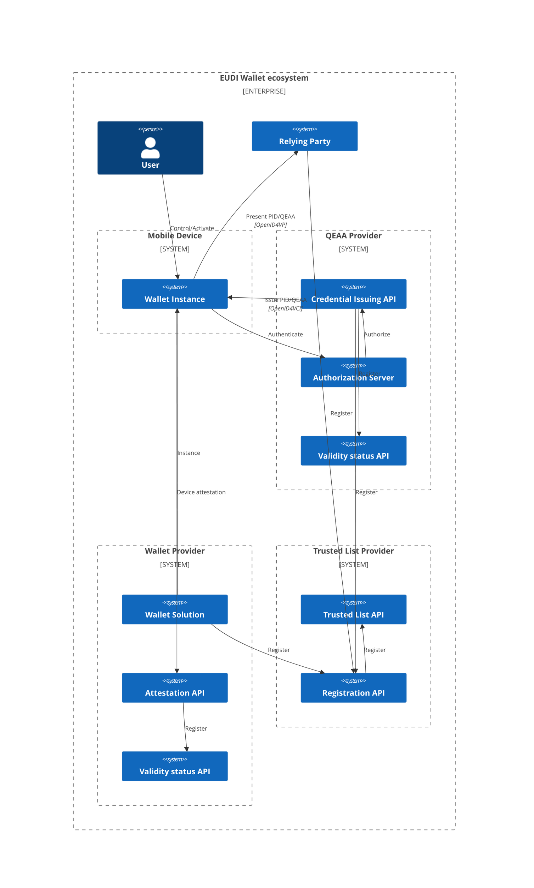
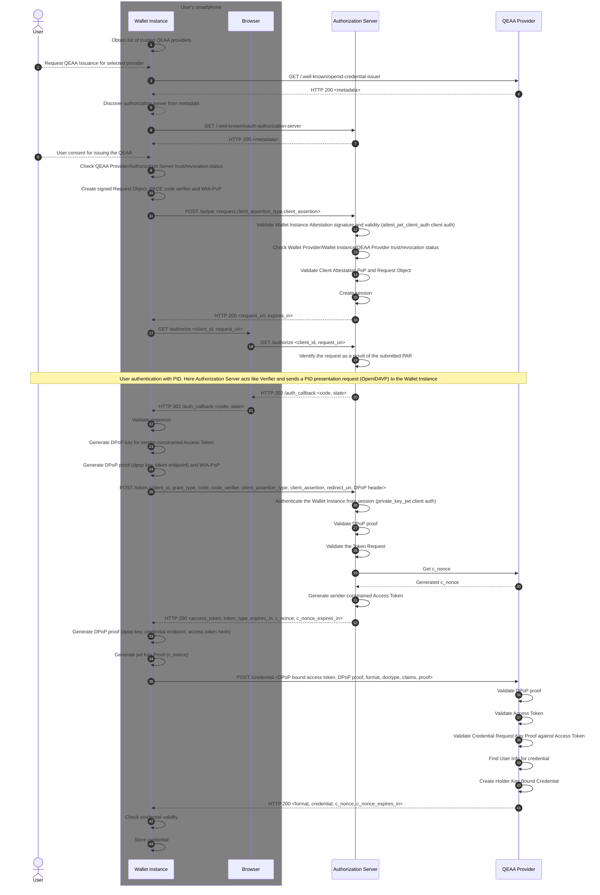
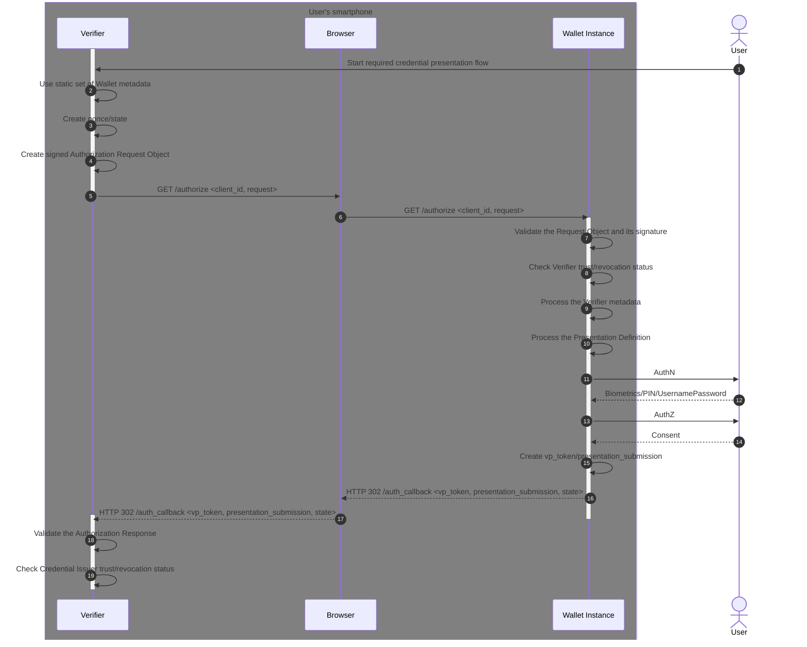

# Summary

This document implements Mobile Driving Licence use case and Qualified Electronic Attestations of Attributes Provider
from [EUDI Architecture and Reference Framework][EUDI-ARF]. [EUDI-ARF] defines the architecture of the EUDI ecosystem
and the set of technical standards planned to ensure interoperability among different parties.

The aim is to ensure that the Estonian (Q)EAA issuer implementation is interoperable within the EUDI ecosystem across
all member states, while meeting the necessary security, privacy, and user experience standards.
# Versions

|Version|Date|Changes|
|:----|:----|:----|
|1.0.0|30.11.2023|EUDI (Q)EAA Provider Technical Documentation|
# Keywords

This document uses the capitalized
keywords `MUST`, `MUST NOT`, `REQUIRED`, `SHALL`, `SHALL NOT`, `SHOULD`, `SHOULD NOT`, `RECOMMENDED`, `MAY`
and `OPTIONAL` as specified in [RFC 2119] to indicate requirements, recommendations and options specified in this
document.

# 1. Requirements and Scope

### EUDI-ARF Requirements

[EUDI Architecture and Reference Framework][EUDI-ARF] Sections 5 and 6 specify the requirements for PID and (Q)EAA
Providers and EUDI Wallet Solution implementers.

### Implementation Scope

1. Only QEAA Provider related requirements `SHALL` be considered.
2. Only Mobile Driving Licence (mDL) use case `SHALL` be considered.
3. Only Type 1 configuration requirements `SHALL` be considered.
4. Only [ISO/IEC 18013-5:2021] data model `SHALL` be considered, due to EC Regulation 2023_127 (4th Driving License
   Regulation). This affects [EUDI-ARF] Section 5.2.1 requirements
   6,7,9 and 10 and Section 6.5.3 Attestation exchange Protocol - 7, Data model -2, PID & (Q)EAA formats -
   1 and Signature formats -1 requirements.
5. Only same-device issuing ([OPENID4VCI]) and presentation ([OPENID4VP]) flows `SHALL` be considered.
6. Pseudonymous authentication ([SIOPv2]) `SHALL NOT` be considered in [OpenID4VP] attestation exchange protocol. This
   affects [EUDI-ARF] Section 6.5.3 Attestation exchange Protocol - 1 requirement.
7. Trusted List mechanism to publish and obtain information about authoritative parties, e.g. Issuers of PID, (Q)EAA and
   Relying Parties as defined in [EUDI-ARF] Section 6.2 `SHALL NOT` be considered[^1].
8. Relying Party `MUST` be authenticated to Wallet Instance in [OPENID4VP] presentation flow[^1].
9. Wallet Instance `SHALL NOT` be required to authenticate to Relying Party in [OPENID4VP] presentation flow[^1].
10. The User `SHALL` have a valid Wallet Instance Attestation stored in a Wallet Instance[^1].
11. The User `SHALL` have a valid Person Identification Data Attestation stored in a Wallet Instance[^1].
12. The Authorization Server and Credential Issuer `SHALL` be considered as separate entities in [OPENID4VCI] protocol
    implementation.
13. The authorization response in [OPENID4VP] flow `SHALL NOT` be encrypted.

[^1]: Implementation details are still under discussion within the EUDI Wallet ecosystem.

# 2. Components



# 3. Attestations

## 3.1. mDL

### MDOC-CBOR Format

This section describes the structure, type, data element identifiers and logical organisation of the mandatory
attributes of the CBOR encoded Mobile Driving License (mDL) attestation.

mDL data model is described in section 7 of [ISO/IEC 18013-5:2021], the standard for the mobile driving license
use case.

<a id="mdl-document-type-and-namespace"></a>
**mDL document type and namespace**

Document type and namespace are used to encapsulate the document type and the space in which the data elements are
defined.

1. The document type for an mDL document `SHALL` be `org.iso.18013.5.1.mDL`.
2. The namespace for mDL data elements defined
   in [Mandatory mDL data elements](#mdl-mandatory-mdl-data-elements) `SHALL`
   be `org.iso.18013.5.1`.

<a id="mdl-mandatory-mdl-data-elements"></a>
**Mandatory mDL data elements**

1. Following data elements `SHALL` be considered by this document and are declared mandatory by [ISO/IEC 18013-5:2021],
   7.2.1.

|Identifier|Description|Encoding|
|:----|:----|:----|
|`family_name`|Last name, surname, or primary identifier, of the mDL holder.|`tstr`|
|`given_name`|First name(s), other name(s), or secondary identifier, of the mDL holder.|`tstr`|
|`birth_date`|Day, month and year on which the mDL holder was born.|`full-date`|
|`issue_date`|Date when mDL was issued.|`tdate` or `fulldate`|
|`expiry_date`|Date when mDL expires.|`tdate` or `fulldate`|
|`issuing_country`|Alpha-2 country code, as defined in ISO 3166-1, of the issuing authority’s country or territory.|`tstr`|
|`issuing_authority`|Issuing authority name.|`tstr`|
|`document_number`|The number assigned or calculated by the issuing authority.|`tstr`|
|`portrait`|A reproduction of the mDL holder’s portrait.|`bstr`|
|`driving_privileges`|Driving privileges of the mDL holder.|See [ISO/IEC 18013-5:2021], 7.2.4|
|`un_distinguishing_sign`|Distinguishing sign of the issuing country according to [ISO/IEC 18013-1:2018], Annex F.|`tstr`|

<a id="mdl-cbor-data-types"></a>
**CBOR Data Types**

Following data types are used by [ISO/IEC 18013-5:2021] and are defined in [RFC 8949]:

|Type|Major types|Description|
|:----|:----|:----|
|`any`||A nonspecific value that permits all CBOR values to be placed here.|
|`bool`|#7.20, #7.21|A boolean value.|
|`bstr`|#2|A byte string.|
|`int`|#0, #1, #7.25, #7.26, #7.27|An unsigned integer or a negative integer.|
|`uint`|#0|An unsigned integer.|
|`nint`|#1|A negative integer.|
|`null`, `nil`|#7.22|A null value.|
|`tstr`|#3|A UTF-8 text string.|
|`tdate`|#6.0, #6.1|As defined in [RFC 8610].|
|`full-date`|#6.1004, #6.100|As defined in [RFC 8943].|
|`array`|#4| An array of data items.|
|`map`|#5|A map of pairs of data items.|
|`encoded-cbor`|#6.24|Encoded CBOR data item as defined in [RFC 8949], 3.4.5.1. Tag number 24 (CBOR data item) can be used to tag the embedded byte string as a single data item encoded in CBOR format.|

#### Document Schema

This document will specify the elements required solely for the [OpenID4VP] presentation flow.

<a id="mdl-document-structure"></a>
**Document**

A root element of mDL document, that contains following elements as CBOR encoded `map`:

|Element|Description|Encoding|
|:----|:----|:----|
|`docType`|The document type. It `MUST` be set to `org.iso.18013.5.1.mDL`|`tstr`|
|`issuerSigned`| Contains [IssuerSigned](#mdl-issuer-signed-structure) structure for returned data elements signed by the issuer.|`map`|
|`deviceSigned`| Contains [DeviceSigned](#mdl-device-signed-structure) structure for returned data elements signed by the device (Wallet). It is not returned in [OpenID4VCI] issuance flow an is used exclusively in [OpenID4VP] presentation flow.|`map`|

<a id="mdl-issuer-signed-structure"></a>
**IssuerSigned**

It contains data elements that are signed by the issuing authority. This provides integrity and authenticity for these
data elements through `issuer data authentication` discussed in [ISO/IEC 18013-5:2021], 9.1.2.

|Element|Description|Encoding|
|:----|:----|:----|
|`nameSpaces`|Contains [IssuerNameSpaces](#mdl-issuer-names-paces-structure) structure for returned data elements signed by issuer.|`map`|
|`issuerAuth`|Contains [IssuerAuth](#mdl-issuer-auth-structure) structure for `issuer data authentication`.|`map`|

<a id="mdl-issuer-names-paces-structure"></a>
**IssuerNameSpaces,**

The `IssuerNameSpaces` is a `map` type that contains namespaces as keys and array of `IssuerSignedItem`'s encoded in
CBOR Tag
24 ([cbor-tags]) as values, representing the disclosure information for each digest within
the [Mobile Security Object](#mdl-mobile-security-object).
It is not signed by [Mobile Security Object](#mdl-mobile-security-object) and can be used to selectively disclose
attestation data.

<a id="mdl-issuer-signed-item-structure"></a>
**IssuerSignedItem**

|Element|Description|Encoding|
|:----|:----|:----|
|`elementIdentifier`|Data element identifier. It `MUST` be set to any identifier specified in [Mandatory mDL data elements](#mdl-mandatory-mdl-data-elements)|`tstr`|
|`elementValue`|Data element value.|`any`|
|`digestID`|Digest ID for issuer data authentication.|`uint`|
|`random`|Random value for issuer data authentication to prevent the digests themselves from leaking information about the data element contents.|`bstr`|

<a id="mdl-issuer-auth-structure"></a>
**IssuerAuth**

The `IssuerAuth` is an untagged value containing a [COSE_Sign1 structure](#mdl-cose-sign1-structure), as defined
in [RFC 9052]; 4.2, where `payload` is [Mobile Security Object](#mdl-mobile-security-object) encoded in CBOR Tag
24 ([cbor-tags]).

A non-normative example of the `issuerAuth` in CBOR binary encoding:

```
a16a697373756572417574688443a10126a11821825901533082014f3081f5a0030201020208a7276d952e234ed3300a06082a8648ce3d04030230183116301406035504030c0d4d444f4320497465726d204341301e170d3233313030363134303230375a170d3233313030373134303230375a3021311f301d06035504030c164d444f4320497465726d2054657374204973737565723059301306072a8648ce3d020106082a8648ce3d0301070342000415fbbd14d4c1e102db5ef7b774bc522b4907c5f2e022029e0d7a07dac2a2d16e830cdcf50ac4869c53a6ac3026a7719b31746ecdf5b6214371ea0176bdb6549fa320301e300c0603551d130101ff04023000300e0603551d0f0101ff040403020780300a06082a8648ce3d0403020349003046022100aca0267164e4a07ffee123e155a03c8add49f2b58290f5ab20401c275a1e5960022100bb93d74d49a21f30ea330110bda124fda68156f469ea43e502a29a0b8553491559014c308201483081eea0030201020208052d609340e6a580300a06082a8648ce3d04030230173115301306035504030c0c4d444f4320524f4f54204341301e170d3233313030363134303230375a170d3233313030373134303230375a30183116301406035504030c0d4d444f4320497465726d2043413059301306072a8648ce3d020106082a8648ce3d030107034200040edb17ccfcbe549944e1cff1d65234b1e9fa2bdeeb6cfb78cd29f66580796481731535da4f4a0a03243f1cf12e60aad8c96901ef45892052574ea79804f3463ca3233021300f0603551d130101ff040530030101ff300e0603551d0f0101ff040403020106300a06082a8648ce3d0403020349003046022100bb3f6e73db3f9a4ae1d9b100fb3154705e499a068fc3c13454383fa4772acd03022100bf4f2faba60376ec2e5896e722580a5f16c60d6fe4812ea318f4467e56611e1f5902dbd8185902d6a66776657273696f6e63312e306f646967657374416c676f726974686d675348412d3235366c76616c756544696765737473a1716f72672e69736f2e31383031332e352e31ab0058208e794e6ba8252f23edcbd2666cb1073b3fd0f8771e49f0a0d011276fb047ff27015820ed2c5471ab1ccd7a2d00db3e9ae3275d75904a9bcb92bcb95dddf27b71bfb30b02582041c988cc5d7fcaa1ddbac193140da6f7a3a8352b68e6d56ee553a0882628d27e03582031cb399f252e056a71c28c9ca28b249c785dae244bc0f08ffa4ca4d70dfe16820458208444b5052ca02399ee973e0b01f605e0fc6fdb728d69cb8d3583efd0b283eec0055820f99ec3a3ba6b5d1d4dbdeefe0d2f6c38985937920e2b993429a8f152b61d540e0658208e4222d730bdc0b514353948be7d94cf715d525be2983b12b911893df86289f6075820cef5fc62570abdafe15ae9995c0a1ef3dd52df20d04400e52da48bf58c90e7d808582030f0c29056c8882059a65155399d79f0b250340721efd9910ca99bc6f67981ef095820b1ba0d0db16abbaa868d9f0b07534f2933f7f3c5b32838bc9d0a8435f9ae0ad40a58208f191c2093fc55cbf9229ee375f4569a4128b55a69b654be65d90c3f5fea7d106d6465766963654b6579496e666fa1696465766963654b6579a401022001215820bc834b5d33cc69a120410cf9ba7c0cd08e86c9750bd8a812c2629dabc5853a0f2258208bb8dc2fd6733f623d4c662ada00e481cb7a4a154b1dfe242d54acfaedb8b87267646f6354797065756f72672e69736f2e31383031332e352e312e6d444c6c76616c6964697479496e666fa3667369676e6564c0781e323032332d31302d30365431343a30323a30372e3932393436373630305a6976616c696446726f6dc0781e323032332d31302d30365431343a30323a30372e3932393436373630305a6a76616c6964556e74696cc0781e323032342d31302d30355431343a30323a30372e3932393436373630305a58406b5192db86e78a1606e235d4e2ee9cd12f42cc77283c83d94d2a585c7ec3c0e0224240cec14b2b5d7e3e9ab4b72b8036c3ae71dacd36fd8458e065bbe75fccc1
```

A non-normative example of the `issuerAuth` in CBOR diagnostic notation:

```
{
  "issuerAuth": [
    h
    'a10126',
    {
      33_0: [
        h
        '3082014f3081f5a0030201020208a7276d952e234ed3300a06082a8648ce3d04030230183116301406035504030c0d4d444f4320497465726d204341301e170d3233313030363134303230375a170d3233313030373134303230375a3021311f301d06035504030c164d444f4320497465726d2054657374204973737565723059301306072a8648ce3d020106082a8648ce3d0301070342000415fbbd14d4c1e102db5ef7b774bc522b4907c5f2e022029e0d7a07dac2a2d16e830cdcf50ac4869c53a6ac3026a7719b31746ecdf5b6214371ea0176bdb6549fa320301e300c0603551d130101ff04023000300e0603551d0f0101ff040403020780300a06082a8648ce3d0403020349003046022100aca0267164e4a07ffee123e155a03c8add49f2b58290f5ab20401c275a1e5960022100bb93d74d49a21f30ea330110bda124fda68156f469ea43e502a29a0b85534915',
        h
        '308201483081eea0030201020208052d609340e6a580300a06082a8648ce3d04030230173115301306035504030c0c4d444f4320524f4f54204341301e170d3233313030363134303230375a170d3233313030373134303230375a30183116301406035504030c0d4d444f4320497465726d2043413059301306072a8648ce3d020106082a8648ce3d030107034200040edb17ccfcbe549944e1cff1d65234b1e9fa2bdeeb6cfb78cd29f66580796481731535da4f4a0a03243f1cf12e60aad8c96901ef45892052574ea79804f3463ca3233021300f0603551d130101ff040530030101ff300e0603551d0f0101ff040403020106300a06082a8648ce3d0403020349003046022100bb3f6e73db3f9a4ae1d9b100fb3154705e499a068fc3c13454383fa4772acd03022100bf4f2faba60376ec2e5896e722580a5f16c60d6fe4812ea318f4467e56611e1f'
      ]
    },
    h
    'd8185902d6a66776657273696f6e63312e306f646967657374416c676f726974686d675348412d3235366c76616c756544696765737473a1716f72672e69736f2e31383031332e352e31ab0058208e794e6ba8252f23edcbd2666cb1073b3fd0f8771e49f0a0d011276fb047ff27015820ed2c5471ab1ccd7a2d00db3e9ae3275d75904a9bcb92bcb95dddf27b71bfb30b02582041c988cc5d7fcaa1ddbac193140da6f7a3a8352b68e6d56ee553a0882628d27e03582031cb399f252e056a71c28c9ca28b249c785dae244bc0f08ffa4ca4d70dfe16820458208444b5052ca02399ee973e0b01f605e0fc6fdb728d69cb8d3583efd0b283eec0055820f99ec3a3ba6b5d1d4dbdeefe0d2f6c38985937920e2b993429a8f152b61d540e0658208e4222d730bdc0b514353948be7d94cf715d525be2983b12b911893df86289f6075820cef5fc62570abdafe15ae9995c0a1ef3dd52df20d04400e52da48bf58c90e7d808582030f0c29056c8882059a65155399d79f0b250340721efd9910ca99bc6f67981ef095820b1ba0d0db16abbaa868d9f0b07534f2933f7f3c5b32838bc9d0a8435f9ae0ad40a58208f191c2093fc55cbf9229ee375f4569a4128b55a69b654be65d90c3f5fea7d106d6465766963654b6579496e666fa1696465766963654b6579a401022001215820bc834b5d33cc69a120410cf9ba7c0cd08e86c9750bd8a812c2629dabc5853a0f2258208bb8dc2fd6733f623d4c662ada00e481cb7a4a154b1dfe242d54acfaedb8b87267646f6354797065756f72672e69736f2e31383031332e352e312e6d444c6c76616c6964697479496e666fa3667369676e6564c0781e323032332d31302d30365431343a30323a30372e3932393436373630305a6976616c696446726f6dc0781e323032332d31302d30365431343a30323a30372e3932393436373630305a6a76616c6964556e74696cc0781e323032342d31302d30355431343a30323a30372e3932393436373630305a',
    h
    '6b5192db86e78a1606e235d4e2ee9cd12f42cc77283c83d94d2a585c7ec3c0e0224240cec14b2b5d7e3e9ab4b72b8036c3ae71dacd36fd8458e065bbe75fccc1'
  ]
}
```

<a id="mdl-cose-sign1-structure"></a>
**COSE_Sign1 structure**

CDDL ([RFC 8610]) fragment that represents the `COSE_Sign1` as defined in [RFC 9052], 4.2:

```
COSE_Sign1 = [
    Headers,
    payload : bstr / nil,
    signature : bstr
]

Headers = (
    protected : empty_or_serialized_map,
    unprotected : header_map
)

header_map = {
    Generic_Headers,
    * label => values
}

empty_or_serialized_map = bstr .cbor header_map / bstr .size 0
```

**Protected header**

A CBOR `bstr` that encapsulates a CBOR `map` of protected headers. These headers are covered by the
signature.

1. It `MUST` contain `alg` header as defined in [RFC 9052], 3.1 and [iana-cose]
2. Other elements should not be present in the protected header as required by [ISO/IEC 18013-5:2021], 9.1.2.4.

Non-normative example of protected header, that contains `alg` header parameter:

CBOR binary encoding:

```
43a10126
```

Corresponding CBOR diagnostic notation [RFC 8610]:

```
h'a10126'
```

`a10126` in CBOR diagnostic notation, where `1` denotes `alg` header as defined in [iana-cose], Headers section and `-7`
denotes algorithm ES256 as defined in [iana-cose], Algorithms section. The exact steps how to decode CBOR is discussed
in [RFC 8949].

```
{
  1: -7
}
```

**Unprotected header**

A CBOR `map` of unprotected headers. These headers are not covered by the signature, so they can be
changed without invalidating the signature.

1. It `MUST` contain `x5chain` header parameter as defined in [RFC 9360] and required by [ISO/IEC 18013-5:2021],
   9.1.2.4.
2. If a single certificate is conveyed in `x5chain`, it `SHALL` be placed in a CBOR byte string.
3. If multiple certificates are conveyed in `x5chain`, a CBOR array of byte strings `SHALL` be used, with each
   certificate being in its own byte string.
2. It `MUST` be included as an unprotected header element as suggested in [ISO/IEC 18013-5:2021], 9.1.2.4. It is
   included in the unprotected header to enable the Holder to update the X.509 certificate chain, without breaking the
   signature.
3. It `MUST` include at least one DER-encoded certificate and `MAY` contain more.
4. First certificate in `x5chain` `MUST` be mDL issuer signing certificate.
5. Certificates contained in `x5chain` header parameter `MUST` use certificate profiles as described
   in [ISO/IEC 18013-5:2021], Annex B.
6. The Issuing Authority Certificate Authority (IACA) root certificate `MUST NOT` be included in the `x5chain` element.
7. The Issuing Authority infrastructure `SHALL` use one of the following signature algorithms for calculating
   the signature over the MSO: "ES256" (ECDSA with SHA-256), "ES384" (ECDSA with SHA-384),   "ES512" (ECDSA with
   SHA-512) or "EdDSA" (EdDSA). "ES256" shall be used with curves P-256 and brainpoolP256r1. "ES384" shall be used with
   curves P-384, brainpoolP320r1 and brainpoolP384r1.   "ES512" shall be used with curves P-521 and brainpoolP512r1. "
   EdDSA" shall be used with curves Ed25519 and Ed448. The Verifier `MUST` support all of these signature algorithms and
   curves.

Non-normative example of unprotected header, that contains `x5chain` header parameter in CBOR binary encoding:

```
a11821825901533082014f3081f5a0030201020208a7276d952e234ed3300a06082a8648ce3d04030230183116301406035504030c0d4d444f4320497465726d204341301e170d3233313030363134303230375a170d3233313030373134303230375a3021311f301d06035504030c164d444f4320497465726d2054657374204973737565723059301306072a8648ce3d020106082a8648ce3d0301070342000415fbbd14d4c1e102db5ef7b774bc522b4907c5f2e022029e0d7a07dac2a2d16e830cdcf50ac4869c53a6ac3026a7719b31746ecdf5b6214371ea0176bdb6549fa320301e300c0603551d130101ff04023000300e0603551d0f0101ff040403020780300a06082a8648ce3d0403020349003046022100aca0267164e4a07ffee123e155a03c8add49f2b58290f5ab20401c275a1e5960022100bb93d74d49a21f30ea330110bda124fda68156f469ea43e502a29a0b8553491559014c308201483081eea0030201020208052d609340e6a580300a06082a8648ce3d04030230173115301306035504030c0c4d444f4320524f4f54204341301e170d3233313030363134303230375a170d3233313030373134303230375a30183116301406035504030c0d4d444f4320497465726d2043413059301306072a8648ce3d020106082a8648ce3d030107034200040edb17ccfcbe549944e1cff1d65234b1e9fa2bdeeb6cfb78cd29f66580796481731535da4f4a0a03243f1cf12e60aad8c96901ef45892052574ea79804f3463ca3233021300f0603551d130101ff040530030101ff300e0603551d0f0101ff040403020106300a06082a8648ce3d0403020349003046022100bb3f6e73db3f9a4ae1d9b100fb3154705e499a068fc3c13454383fa4772acd03022100bf4f2faba60376ec2e5896e722580a5f16c60d6fe4812ea318f4467e56611e1f
```

Corresponding example in CBOR diagnostic notation, containing two certificates in DER encoding:

```
{
  33_0: [
    h
    '3082014f3081f5a0030201020208a7276d952e234ed3300a06082a8648ce3d04030230183116301406035504030c0d4d444f4320497465726d204341301e170d3233313030363134303230375a170d3233313030373134303230375a3021311f301d06035504030c164d444f4320497465726d2054657374204973737565723059301306072a8648ce3d020106082a8648ce3d0301070342000415fbbd14d4c1e102db5ef7b774bc522b4907c5f2e022029e0d7a07dac2a2d16e830cdcf50ac4869c53a6ac3026a7719b31746ecdf5b6214371ea0176bdb6549fa320301e300c0603551d130101ff04023000300e0603551d0f0101ff040403020780300a06082a8648ce3d0403020349003046022100aca0267164e4a07ffee123e155a03c8add49f2b58290f5ab20401c275a1e5960022100bb93d74d49a21f30ea330110bda124fda68156f469ea43e502a29a0b85534915',
    h
    '308201483081eea0030201020208052d609340e6a580300a06082a8648ce3d04030230173115301306035504030c0c4d444f4320524f4f54204341301e170d3233313030363134303230375a170d3233313030373134303230375a30183116301406035504030c0d4d444f4320497465726d2043413059301306072a8648ce3d020106082a8648ce3d030107034200040edb17ccfcbe549944e1cff1d65234b1e9fa2bdeeb6cfb78cd29f66580796481731535da4f4a0a03243f1cf12e60aad8c96901ef45892052574ea79804f3463ca3233021300f0603551d130101ff040530030101ff300e0603551d0f0101ff040403020106300a06082a8648ce3d0403020349003046022100bb3f6e73db3f9a4ae1d9b100fb3154705e499a068fc3c13454383fa4772acd03022100bf4f2faba60376ec2e5896e722580a5f16c60d6fe4812ea318f4467e56611e1f'
  ]
}
```

Contained certificates in PEM encoding:

```
-----BEGIN CERTIFICATE-----
MIIBTzCB9aADAgECAginJ22VLiNO0zAKBggqhkjOPQQDAjAYMRYwFAYDVQQDDA1NRE9DIEl0ZXJt
IENBMB4XDTIzMTAwNjE0MDIwN1oXDTIzMTAwNzE0MDIwN1owITEfMB0GA1UEAwwWTURPQyBJdGVy
bSBUZXN0IElzc3VlcjBZMBMGByqGSM49AgEGCCqGSM49AwEHA0IABBX7vRTUweEC2173t3S8UitJ
B8Xy4CICng16B9rCotFugwzc9QrEhpxTpqwwJqdxmzF0bs31tiFDceoBdr22VJ+jIDAeMAwGA1Ud
EwEB/wQCMAAwDgYDVR0PAQH/BAQDAgeAMAoGCCqGSM49BAMCA0kAMEYCIQCsoCZxZOSgf/7hI+FV
oDyK3UnytYKQ9asgQBwnWh5ZYAIhALuT101Joh8w6jMBEL2hJP2mgVb0aepD5QKimguFU0kV
-----END CERTIFICATE-----

-----BEGIN CERTIFICATE-----
MIIBSDCB7qADAgECAggFLWCTQOalgDAKBggqhkjOPQQDAjAXMRUwEwYDVQQDDAxNRE9DIFJPT1Qg
Q0EwHhcNMjMxMDA2MTQwMjA3WhcNMjMxMDA3MTQwMjA3WjAYMRYwFAYDVQQDDA1NRE9DIEl0ZXJt
IENBMFkwEwYHKoZIzj0CAQYIKoZIzj0DAQcDQgAEDtsXzPy+VJlE4c/x1lI0sen6K97rbPt4zSn2
ZYB5ZIFzFTXaT0oKAyQ/HPEuYKrYyWkB70WJIFJXTqeYBPNGPKMjMCEwDwYDVR0TAQH/BAUwAwEB
/zAOBgNVHQ8BAf8EBAMCAQYwCgYIKoZIzj0EAwIDSQAwRgIhALs/bnPbP5pK4dmxAPsxVHBeSZoG
j8PBNFQ4P6R3Ks0DAiEAv08vq6YDduwuWJbnIlgKXxbGDW/kgS6jGPRGflZhHh8=
-----END CERTIFICATE-----

```

**Payload**

Contains [Mobile Security Object](#mdl-mobile-security-object) encoded in CBOR Tag 24 ([cbor-tags])

**Signature**

The actual cryptographic signature as `bstr`. The signature is computed over the protected headers and the `payload`.

<a id="mdl-mobile-security-object"></a>
**Mobile Security Object**

|Element|Description|Encoding|
|:----|:----|:----|
|`version`|MSO version. It `MUST` be set to `1.0`.|`tstr`|
|`docType`|The document type. It `MUST` be set to `org.iso.18013.5.1.mDL`|`tstr`|
|`digestAlgorithm`|Message digest algorithm used. It `MUST` be set to `SHA-256`, `SHA-384` or `SHA-512`.|`tstr`|
|`valueDigests`|Digests of all data elements per namespace. It contains `digestsID`'s as keys and corresponding data element `digest` as as values. It `MUST` contain namespace `org.iso.18013.5.1`. It `MUST` contain all [Mandatory mDL data elements](#mdl-mandatory-mdl-data-elements) digests. |`map`|
|`deviceKeyInfo`|Contains [DeviceKeyInfo](#mdl-device-key-info-structure) structure for the `mdoc authentication` public key and information related to this key.|`map`|
|`validityInfo`|Contains [ValidityInfo](#mdl-validity-info-structure) structure for the validity of the MSO and its signature.|`map`|

<a id="mdl-device-key-info-structure"></a>
**DeviceKeyInfo**

1. It `MUST` contain public key defined in WIA `cnf` claim.

|Element|Description|Encoding|
|:----|:----|:----|
|`deviceKey`|It contains the public part of the key pair used for mdoc authentication as untagged `COSE_Key` structure. Further requirements are defined in [ISO/IEC 18013-5:2021], 9.1.5.2.|`map`|

CDDL ([RFC 8610]) fragment that represents the `COSE_Key` as defined in [RFC 9052], 7, [iana-cose]
and [ISO/IEC 18013-5:2021], 9.1.5.2:

```
COSE_Key = {
   2 => int,            ; kty: key type
   -1 => int,           ; crv: EC identifier - From the "COSE Elliptic Curves" registry [iana-cose]
   -2 => bstr,          ; x: value of x-coordinate [iana-cose]
   ? -3 => bstr/ bool   ; y: value or sign bit of y-coordinate; only applicable for EC2 key types [iana-cose]
}
```

<a id="mdl-validity-info-structure"></a>
**ValidityInfo**

|Element|Description|Encoding|
|:----|:----|:----|
|`signed`|Signature timestamp.|`tdate`|
|`validFrom`|Validity start timestamp.|`tdate`|
|`validUntil`|Validity end timestamp.|`tdate`|

A non-normative example of the `Mobile Security Object` in CBOR binary encoding:

```
d8185902d6a66776657273696f6e63312e306f646967657374416c676f726974686d675348412d3235366c76616c756544696765737473a1716f72672e69736f2e31383031332e352e31ab0058208e794e6ba8252f23edcbd2666cb1073b3fd0f8771e49f0a0d011276fb047ff27015820ed2c5471ab1ccd7a2d00db3e9ae3275d75904a9bcb92bcb95dddf27b71bfb30b02582041c988cc5d7fcaa1ddbac193140da6f7a3a8352b68e6d56ee553a0882628d27e03582031cb399f252e056a71c28c9ca28b249c785dae244bc0f08ffa4ca4d70dfe16820458208444b5052ca02399ee973e0b01f605e0fc6fdb728d69cb8d3583efd0b283eec0055820f99ec3a3ba6b5d1d4dbdeefe0d2f6c38985937920e2b993429a8f152b61d540e0658208e4222d730bdc0b514353948be7d94cf715d525be2983b12b911893df86289f6075820cef5fc62570abdafe15ae9995c0a1ef3dd52df20d04400e52da48bf58c90e7d808582030f0c29056c8882059a65155399d79f0b250340721efd9910ca99bc6f67981ef095820b1ba0d0db16abbaa868d9f0b07534f2933f7f3c5b32838bc9d0a8435f9ae0ad40a58208f191c2093fc55cbf9229ee375f4569a4128b55a69b654be65d90c3f5fea7d106d6465766963654b6579496e666fa1696465766963654b6579a401022001215820bc834b5d33cc69a120410cf9ba7c0cd08e86c9750bd8a812c2629dabc5853a0f2258208bb8dc2fd6733f623d4c662ada00e481cb7a4a154b1dfe242d54acfaedb8b87267646f6354797065756f72672e69736f2e31383031332e352e312e6d444c6c76616c6964697479496e666fa3667369676e6564c0781e323032332d31302d30365431343a30323a30372e3932393436373630305a6976616c696446726f6dc0781e323032332d31302d30365431343a30323a30372e3932393436373630305a6a76616c6964556e74696cc0781e323032342d31302d30355431343a30323a30372e3932393436373630305a
```

A non-normative example of the `Mobile Security Object` in CBOR diagnostic notation:

```
24_0(<<{
  "version": "1.0",
  "digestAlgorithm": "SHA-256",
  "valueDigests": {
    "org.iso.18013.5.1": {
      0: h
      '8e794e6ba8252f23edcbd2666cb1073b3fd0f8771e49f0a0d011276fb047ff27',
      1: h
      'ed2c5471ab1ccd7a2d00db3e9ae3275d75904a9bcb92bcb95dddf27b71bfb30b',
      2: h
      '41c988cc5d7fcaa1ddbac193140da6f7a3a8352b68e6d56ee553a0882628d27e',
      3: h
      '31cb399f252e056a71c28c9ca28b249c785dae244bc0f08ffa4ca4d70dfe1682',
      4: h
      '8444b5052ca02399ee973e0b01f605e0fc6fdb728d69cb8d3583efd0b283eec0',
      5: h
      'f99ec3a3ba6b5d1d4dbdeefe0d2f6c38985937920e2b993429a8f152b61d540e',
      6: h
      '8e4222d730bdc0b514353948be7d94cf715d525be2983b12b911893df86289f6',
      7: h
      'cef5fc62570abdafe15ae9995c0a1ef3dd52df20d04400e52da48bf58c90e7d8',
      8: h
      '30f0c29056c8882059a65155399d79f0b250340721efd9910ca99bc6f67981ef',
      9: h
      'b1ba0d0db16abbaa868d9f0b07534f2933f7f3c5b32838bc9d0a8435f9ae0ad4',
      10: h
      '8f191c2093fc55cbf9229ee375f4569a4128b55a69b654be65d90c3f5fea7d10'
    }
  },
  "deviceKeyInfo": {
    "deviceKey": {
      1: 2,
      -1: 1,
      -2: h
      'bc834b5d33cc69a120410cf9ba7c0cd08e86c9750bd8a812c2629dabc5853a0f',
      -3: h
      '8bb8dc2fd6733f623d4c662ada00e481cb7a4a154b1dfe242d54acfaedb8b872'
    }
  },
  "docType": "org.iso.18013.5.1.mDL",
  "validityInfo": {
    "signed": 0(
    "2023-10-06T14:02:07.929467600Z"
    ),
    "validFrom": 0(
    "2023-10-06T14:02:07.929467600Z"
    ),
    "validUntil": 0(
    "2024-10-05T14:02:07.929467600Z"
    )
  }
}>>)

```

#### Validation

1. mDL `MUST` be validated as directed in [ISO/IEC 18013-5:2021], 9.3.

#### Example mDL

A non-normative example of the mDL document in CBOR binary encoding:

```
a267646f6354797065756f72672e69736f2e31383031332e352e312e6d444c6c6973737565725369676e6564a26a6e616d65537061636573a1716f72672e69736f2e31383031332e352e318bd8185856a4686469676573744944006672616e646f6d502b4d4771f7224034f241bcddb144f9f171656c656d656e744964656e7469666965726b66616d696c795f6e616d656c656c656d656e7456616c7565674dc3a46e6e696bd8185857a4686469676573744944016672616e646f6d5090a3e1c6daedf0550d674d514a34242071656c656d656e744964656e7469666965726a676976656e5f6e616d656c656c656d656e7456616c7565694d6172692d4c696973d818585ba4686469676573744944026672616e646f6d5085560d170574e55484793bc8e0afb36571656c656d656e744964656e7469666965726a62697274685f646174656c656c656d656e7456616c7565d903ec6a313937312d30312d3031d818585ba4686469676573744944036672616e646f6d505b010bf5e03ea3c6a53b8cf845607af771656c656d656e744964656e7469666965726a69737375655f646174656c656c656d656e7456616c7565d903ec6a323032302d30312d3031d818585ca4686469676573744944046672616e646f6d50661f1d8aeed3000d997190492cec6a4371656c656d656e744964656e7469666965726b6578706972795f646174656c656c656d656e7456616c7565d903ec6a323033302d30312d3031d8185855a4686469676573744944056672616e646f6d50860380e65d1cb83acb0092956d7fc36971656c656d656e744964656e7469666965726f69737375696e675f636f756e7472796c656c656d656e7456616c7565624545d8185858a4686469676573744944066672616e646f6d5062e2ea2fc0be2824cfb45e529ffae79971656c656d656e744964656e7469666965727169737375696e675f617574686f726974796c656c656d656e7456616c75656341524bd818585ba4686469676573744944076672616e646f6d50df3f39abee756fa40bec55643dd58abb71656c656d656e744964656e7469666965726f646f63756d656e745f6e756d6265726c656c656d656e7456616c7565684554303030303030d818590404a4686469676573744944086672616e646f6d50b2ece895f55d182e08e96dbf985cda3271656c656d656e744964656e74696669657268706f7274726169746c656c656d656e7456616c75655903b6ffd8ffe000104a46494600010101006000600000ffdb0043000302020302020303030304030304050805050404050a070706080c0a0c0c0b0a0b0b0d0e12100d0e110e0b0b1016101113141515150c0f171816141812141514ffdb00430103040405040509050509140d0b0d1414141414141414141414141414141414141414141414141414141414141414141414141414141414141414141414141414ffc00011080012001203012200021101031101ffc4001f0000010501010101010100000000000000000102030405060708090a0bffc400b5100002010303020403050504040000017d01020300041105122131410613516107227114328191a1082342b1c11552d1f02433627282090a161718191a25262728292a3435363738393a434445464748494a535455565758595a636465666768696a737475767778797a838485868788898a92939495969798999aa2a3a4a5a6a7a8a9aab2b3b4b5b6b7b8b9bac2c3c4c5c6c7c8c9cad2d3d4d5d6d7d8d9dae1e2e3e4e5e6e7e8e9eaf1f2f3f4f5f6f7f8f9faffc4001f0100030101010101010101010000000000000102030405060708090a0bffc400b51100020102040403040705040400010277000102031104052131061241510761711322328108144291a1b1c109233352f0156272d10a162434e125f11718191a262728292a35363738393a434445464748494a535455565758595a636465666768696a737475767778797a82838485868788898a92939495969798999aa2a3a4a5a6a7a8a9aab2b3b4b5b6b7b8b9bac2c3c4c5c6c7c8c9cad2d3d4d5d6d7d8d9dae2e3e4e5e6e7e8e9eaf2f3f4f5f6f7f8f9faffda000c03010002110311003f00fb4bc69e365d726f136adad78b2ebc0ff0d7c31789a65d5d589f26e751bb2c88e4ce033c502492c718f2c2bb48ae4b040034576bff00086ea5e256f87be2cd5b5ed57c2620975df08eb5a94fa8acb0c91f9aa8935c334914cd16e6460e549003a9eab5afaee7f03dd6bbe07bd8f4463aa6b371ad693178914ae9facdbdc4ad3cf6866daca970933b900ab1dbe5b0561b82bf5cf885e21d1f58d614e93e1cd33c5dadd90b2d23c37a6ce2fb52bebb0760b9bd9163023b68411c90e02331660c563ad083dc345d5ed7c41a3d8ea961289ec6fa08ee60947478dd432b7e208a2b3fc0be178bc11e09f0f7872090cb0e91a75be9e921ce5962896307924f217b9345202f6b3a1e9de22d3e5b0d5b4fb5d4ec65c7996b790acd13e0e465581079aa1e15f01f867c0b6f241e1bf0ee93e1f864c6f8f4ab18ad95b1d32114668a29f403768a28a407ffd9d818585aa4686469676573744944096672616e646f6d50e9bfd3a7a6e15c1a74ee61de44b03e9971656c656d656e744964656e7469666965727264726976696e675f70726976696c656765736c656c656d656e7456616c75658261416142d818585da46864696765737449440a6672616e646f6d50dde8b53a73c496f8017cafec8fbfd85271656c656d656e744964656e74696669657276756e5f64697374696e6775697368696e675f7369676e6c656c656d656e7456616c7565634553546a697373756572417574688443a10126a11821825901533082014f3081f5a0030201020208a7276d952e234ed3300a06082a8648ce3d04030230183116301406035504030c0d4d444f4320497465726d204341301e170d3233313030363134303230375a170d3233313030373134303230375a3021311f301d06035504030c164d444f4320497465726d2054657374204973737565723059301306072a8648ce3d020106082a8648ce3d0301070342000415fbbd14d4c1e102db5ef7b774bc522b4907c5f2e022029e0d7a07dac2a2d16e830cdcf50ac4869c53a6ac3026a7719b31746ecdf5b6214371ea0176bdb6549fa320301e300c0603551d130101ff04023000300e0603551d0f0101ff040403020780300a06082a8648ce3d0403020349003046022100aca0267164e4a07ffee123e155a03c8add49f2b58290f5ab20401c275a1e5960022100bb93d74d49a21f30ea330110bda124fda68156f469ea43e502a29a0b8553491559014c308201483081eea0030201020208052d609340e6a580300a06082a8648ce3d04030230173115301306035504030c0c4d444f4320524f4f54204341301e170d3233313030363134303230375a170d3233313030373134303230375a30183116301406035504030c0d4d444f4320497465726d2043413059301306072a8648ce3d020106082a8648ce3d030107034200040edb17ccfcbe549944e1cff1d65234b1e9fa2bdeeb6cfb78cd29f66580796481731535da4f4a0a03243f1cf12e60aad8c96901ef45892052574ea79804f3463ca3233021300f0603551d130101ff040530030101ff300e0603551d0f0101ff040403020106300a06082a8648ce3d0403020349003046022100bb3f6e73db3f9a4ae1d9b100fb3154705e499a068fc3c13454383fa4772acd03022100bf4f2faba60376ec2e5896e722580a5f16c60d6fe4812ea318f4467e56611e1f5902dbd8185902d6a66776657273696f6e63312e306f646967657374416c676f726974686d675348412d3235366c76616c756544696765737473a1716f72672e69736f2e31383031332e352e31ab0058208e794e6ba8252f23edcbd2666cb1073b3fd0f8771e49f0a0d011276fb047ff27015820ed2c5471ab1ccd7a2d00db3e9ae3275d75904a9bcb92bcb95dddf27b71bfb30b02582041c988cc5d7fcaa1ddbac193140da6f7a3a8352b68e6d56ee553a0882628d27e03582031cb399f252e056a71c28c9ca28b249c785dae244bc0f08ffa4ca4d70dfe16820458208444b5052ca02399ee973e0b01f605e0fc6fdb728d69cb8d3583efd0b283eec0055820f99ec3a3ba6b5d1d4dbdeefe0d2f6c38985937920e2b993429a8f152b61d540e0658208e4222d730bdc0b514353948be7d94cf715d525be2983b12b911893df86289f6075820cef5fc62570abdafe15ae9995c0a1ef3dd52df20d04400e52da48bf58c90e7d808582030f0c29056c8882059a65155399d79f0b250340721efd9910ca99bc6f67981ef095820b1ba0d0db16abbaa868d9f0b07534f2933f7f3c5b32838bc9d0a8435f9ae0ad40a58208f191c2093fc55cbf9229ee375f4569a4128b55a69b654be65d90c3f5fea7d106d6465766963654b6579496e666fa1696465766963654b6579a401022001215820bc834b5d33cc69a120410cf9ba7c0cd08e86c9750bd8a812c2629dabc5853a0f2258208bb8dc2fd6733f623d4c662ada00e481cb7a4a154b1dfe242d54acfaedb8b87267646f6354797065756f72672e69736f2e31383031332e352e312e6d444c6c76616c6964697479496e666fa3667369676e6564c0781e323032332d31302d30365431343a30323a30372e3932393436373630305a6976616c696446726f6dc0781e323032332d31302d30365431343a30323a30372e3932393436373630305a6a76616c6964556e74696cc0781e323032342d31302d30355431343a30323a30372e3932393436373630305a58406b5192db86e78a1606e235d4e2ee9cd12f42cc77283c83d94d2a585c7ec3c0e0224240cec14b2b5d7e3e9ab4b72b8036c3ae71dacd36fd8458e065bbe75fccc1
```

A non-normative example of the mDL document in CBOR diagnostic notation:

```
{
  "docType": "org.iso.18013.5.1.mDL",
  "issuerSigned": {
    "nameSpaces": {
      "org.iso.18013.5.1": [
        24_0(<<
        {
          "digestID": 0,
          "random": h
          '2b4d4771f7224034f241bcddb144f9f1',
          "elementIdentifier": "family_name",
          "elementValue": "Männik"
        }
        >>),
        24_0(<<
        {
          "digestID": 1,
          "random": h
          '90a3e1c6daedf0550d674d514a342420',
          "elementIdentifier": "given_name",
          "elementValue": "Mari-Liis"
        }
        >>),
        24_0(<<
        {
          "digestID": 2,
          "random": h
          '85560d170574e55484793bc8e0afb365',
          "elementIdentifier": "birth_date",
          "elementValue": 1004_1(
          "1971-01-01"
          )
        }
        >>),
        24_0(<<
        {
          "digestID": 3,
          "random": h
          '5b010bf5e03ea3c6a53b8cf845607af7',
          "elementIdentifier": "issue_date",
          "elementValue": 1004_1(
          "2020-01-01"
          )
        }
        >>),
        24_0(<<
        {
          "digestID": 4,
          "random": h
          '661f1d8aeed3000d997190492cec6a43',
          "elementIdentifier": "expiry_date",
          "elementValue": 1004_1(
          "2030-01-01"
          )
        }
        >>),
        24_0(<<
        {
          "digestID": 5,
          "random": h
          '860380e65d1cb83acb0092956d7fc369',
          "elementIdentifier": "issuing_country",
          "elementValue": "EE"
        }
        >>),
        24_0(<<
        {
          "digestID": 6,
          "random": h
          '62e2ea2fc0be2824cfb45e529ffae799',
          "elementIdentifier": "issuing_authority",
          "elementValue": "ARK"
        }
        >>),
        24_0(<<
        {
          "digestID": 7,
          "random": h
          'df3f39abee756fa40bec55643dd58abb',
          "elementIdentifier": "document_number",
          "elementValue": "ET000000"
        }
        >>),
        24_0(<<
        {
          "digestID": 8,
          "random": h
          'b2ece895f55d182e08e96dbf985cda32',
          "elementIdentifier": "portrait",
          "elementValue": h
          'ffd8ffe000104a46494600010101006000600000ffdb0043000302020302020303030304030304050805050404050a070706080c0a0c0c0b0a0b0b0d0e12100d0e110e0b0b1016101113141515150c0f171816141812141514ffdb00430103040405040509050509140d0b0d1414141414141414141414141414141414141414141414141414141414141414141414141414141414141414141414141414ffc00011080012001203012200021101031101ffc4001f0000010501010101010100000000000000000102030405060708090a0bffc400b5100002010303020403050504040000017d01020300041105122131410613516107227114328191a1082342b1c11552d1f02433627282090a161718191a25262728292a3435363738393a434445464748494a535455565758595a636465666768696a737475767778797a838485868788898a92939495969798999aa2a3a4a5a6a7a8a9aab2b3b4b5b6b7b8b9bac2c3c4c5c6c7c8c9cad2d3d4d5d6d7d8d9dae1e2e3e4e5e6e7e8e9eaf1f2f3f4f5f6f7f8f9faffc4001f0100030101010101010101010000000000000102030405060708090a0bffc400b51100020102040403040705040400010277000102031104052131061241510761711322328108144291a1b1c109233352f0156272d10a162434e125f11718191a262728292a35363738393a434445464748494a535455565758595a636465666768696a737475767778797a82838485868788898a92939495969798999aa2a3a4a5a6a7a8a9aab2b3b4b5b6b7b8b9bac2c3c4c5c6c7c8c9cad2d3d4d5d6d7d8d9dae2e3e4e5e6e7e8e9eaf2f3f4f5f6f7f8f9faffda000c03010002110311003f00fb4bc69e365d726f136adad78b2ebc0ff0d7c31789a65d5d589f26e751bb2c88e4ce033c502492c718f2c2bb48ae4b040034576bff00086ea5e256f87be2cd5b5ed57c2620975df08eb5a94fa8acb0c91f9aa8935c334914cd16e6460e549003a9eab5afaee7f03dd6bbe07bd8f4463aa6b371ad693178914ae9facdbdc4ad3cf6866daca970933b900ab1dbe5b0561b82bf5cf885e21d1f58d614e93e1cd33c5dadd90b2d23c37a6ce2fb52bebb0760b9bd9163023b68411c90e02331660c563ad083dc345d5ed7c41a3d8ea961289ec6fa08ee60947478dd432b7e208a2b3fc0be178bc11e09f0f7872090cb0e91a75be9e921ce5962896307924f217b9345202f6b3a1e9de22d3e5b0d5b4fb5d4ec65c7996b790acd13e0e465581079aa1e15f01f867c0b6f241e1bf0ee93e1f864c6f8f4ab18ad95b1d32114668a29f403768a28a407ffd9'
        }
        >>),
        24_0(<<
        {
          "digestID": 9,
          "random": h
          'e9bfd3a7a6e15c1a74ee61de44b03e99',
          "elementIdentifier": "driving_privileges",
          "elementValue": [
            "A",
            "B"
          ]
        }
        >>),
        24_0(<<
        {
          "digestID": 10,
          "random": h
          'dde8b53a73c496f8017cafec8fbfd852',
          "elementIdentifier": "un_distinguishing_sign",
          "elementValue": "EST"
        }
        >>)
      ]
    },
    "issuerAuth": [
      h
      'a10126',
      {
        33_0: [
          h
          '3082014f3081f5a0030201020208a7276d952e234ed3300a06082a8648ce3d04030230183116301406035504030c0d4d444f4320497465726d204341301e170d3233313030363134303230375a170d3233313030373134303230375a3021311f301d06035504030c164d444f4320497465726d2054657374204973737565723059301306072a8648ce3d020106082a8648ce3d0301070342000415fbbd14d4c1e102db5ef7b774bc522b4907c5f2e022029e0d7a07dac2a2d16e830cdcf50ac4869c53a6ac3026a7719b31746ecdf5b6214371ea0176bdb6549fa320301e300c0603551d130101ff04023000300e0603551d0f0101ff040403020780300a06082a8648ce3d0403020349003046022100aca0267164e4a07ffee123e155a03c8add49f2b58290f5ab20401c275a1e5960022100bb93d74d49a21f30ea330110bda124fda68156f469ea43e502a29a0b85534915',
          h
          '308201483081eea0030201020208052d609340e6a580300a06082a8648ce3d04030230173115301306035504030c0c4d444f4320524f4f54204341301e170d3233313030363134303230375a170d3233313030373134303230375a30183116301406035504030c0d4d444f4320497465726d2043413059301306072a8648ce3d020106082a8648ce3d030107034200040edb17ccfcbe549944e1cff1d65234b1e9fa2bdeeb6cfb78cd29f66580796481731535da4f4a0a03243f1cf12e60aad8c96901ef45892052574ea79804f3463ca3233021300f0603551d130101ff040530030101ff300e0603551d0f0101ff040403020106300a06082a8648ce3d0403020349003046022100bb3f6e73db3f9a4ae1d9b100fb3154705e499a068fc3c13454383fa4772acd03022100bf4f2faba60376ec2e5896e722580a5f16c60d6fe4812ea318f4467e56611e1f'
        ]
      },
      h
      'd8185902d6a66776657273696f6e63312e306f646967657374416c676f726974686d675348412d3235366c76616c756544696765737473a1716f72672e69736f2e31383031332e352e31ab0058208e794e6ba8252f23edcbd2666cb1073b3fd0f8771e49f0a0d011276fb047ff27015820ed2c5471ab1ccd7a2d00db3e9ae3275d75904a9bcb92bcb95dddf27b71bfb30b02582041c988cc5d7fcaa1ddbac193140da6f7a3a8352b68e6d56ee553a0882628d27e03582031cb399f252e056a71c28c9ca28b249c785dae244bc0f08ffa4ca4d70dfe16820458208444b5052ca02399ee973e0b01f605e0fc6fdb728d69cb8d3583efd0b283eec0055820f99ec3a3ba6b5d1d4dbdeefe0d2f6c38985937920e2b993429a8f152b61d540e0658208e4222d730bdc0b514353948be7d94cf715d525be2983b12b911893df86289f6075820cef5fc62570abdafe15ae9995c0a1ef3dd52df20d04400e52da48bf58c90e7d808582030f0c29056c8882059a65155399d79f0b250340721efd9910ca99bc6f67981ef095820b1ba0d0db16abbaa868d9f0b07534f2933f7f3c5b32838bc9d0a8435f9ae0ad40a58208f191c2093fc55cbf9229ee375f4569a4128b55a69b654be65d90c3f5fea7d106d6465766963654b6579496e666fa1696465766963654b6579a401022001215820bc834b5d33cc69a120410cf9ba7c0cd08e86c9750bd8a812c2629dabc5853a0f2258208bb8dc2fd6733f623d4c662ada00e481cb7a4a154b1dfe242d54acfaedb8b87267646f6354797065756f72672e69736f2e31383031332e352e312e6d444c6c76616c6964697479496e666fa3667369676e6564c0781e323032332d31302d30365431343a30323a30372e3932393436373630305a6976616c696446726f6dc0781e323032332d31302d30365431343a30323a30372e3932393436373630305a6a76616c6964556e74696cc0781e323032342d31302d30355431343a30323a30372e3932393436373630305a',
      h
      '6b5192db86e78a1606e235d4e2ee9cd12f42cc77283c83d94d2a585c7ec3c0e0224240cec14b2b5d7e3e9ab4b72b8036c3ae71dacd36fd8458e065bbe75fccc1'
    ]
  }
}
```

#### mDL Presentation

When mDL is presented during [OpenID4VP] presentation flow, the Wallet `MUST` bind authorization request `client_id`
and `nonce` values to the presented mDL. This is accomplished by adding `deviceSigned` element to mDL document
that `SHALL` contain the required `client_id` and `nonce` as device signed elements. Current [ISO/IEC 18013-5:2021]
specification has not considered the requirements of [OpenID4VP] and
therefore current specification extends [SessionTranscript](#mdl-session-transcript-structure) structure with
new `Handover` type [OpenID4VPHandover](#mdl-openid4vp-handover-structure) to support `client_id` and `nonce` as
required by [OpenID4VP].

<a id="mdl-device-signed-structure"></a>
**DeviceSigned**

It contains data elements that are signed by the holder with the key defined
in [Mobile Security Object](#mdl-mobile-security-object). This provides integrity and authenticity for these data
elements
through `mdoc authentication` discussed in [ISO/IEC 18013-5:2021], 9.1.3.

|Element|Description|Encoding|
|:----|:----|:----|
|`nameSpaces`|It `MUST` be set to empty `map` encoded in CBOR Tag 24 ([cbor-tags]).|`encoded-cbor`|
|`deviceAuth`|Contains [DeviceAuth](#mdl-device-auth-structure) structure for `mdoc authentication`.|`map`|

<a id="mdl-device-auth-structure"></a>
**DeviceAuth**

|Element|Description|Encoding|
|:----|:----|:----|
|`deviceSignature`|Contains [DeviceSignature](#mdl-device-signature-structure) structure to authenticate the mdoc with mdoc ECDSA/EdDSA authentication.|`array`|

<a id="mdl-device-signature-structure"></a>
**DeviceSignature**

The `DeviceSignature` is a `COSE_Sign1` structure with [DeviceAuthentication](#mdl-device-authentication-structure)
structure as detached payload - meaning only signature `SHALL` be conveyed and the validator `MUST` reconstruct the
payload to validate the signature.

<a id="mdl-device-authentication-structure"></a>
**DeviceAuthentication**

The `DeviceAuthentication` is a `array` type encoded in CBOR Tag 24 ([cbor-tags]) containing elements in following
order:

|Element|Description|Encoding|
|:----|:----|:----|
|`DeviceAuthentication`|It `MUST` be set to `DeviceAuthentication`.|`tstr`|
|`SessionTranscript`||`array`|
|`DocType`|It `MUST` be set to `org.iso.18013.5.1.mDL`|`tstr`|
|`DeviceNameSpacesBytes`|It `MUST` be set to empty `map`  encoded in CBOR Tag 24 ([cbor-tags]).|`encoded-cbor`|

<a id="mdl-session-transcript-structure"></a>
**SessionTranscript**

The `SessionTranscript` as described in [ISO/IEC 18013-5:2021] Section 9.1.5.1 is a `array` type containing following
elements:

|Element|Description|Encoding|
|:----|:----|:----|
|`DeviceEngagementBytes`|It `MUST` be set to `null`.|`array`|
|`EReaderKeyBytes`|It `MUST` be set to `null`.|`null`|
|`Handover`|It `MUST` be set to [OpenID4VPHandover](#mdl-openid4vp-handover-structure) structure.|`array`|

<a id="mdl-openid4vp-handover-structure"></a>
**OpenID4VPHandover**

The proposed `OpenID4VPHandover` type requires, that `DeviceEngagementBytes` and `EReaderKeyBytes` are set to `null`
in `SessionTranscript`.

|Element|Description|Encoding|
|:----|:----|:----|
|`name`|It `MUST` be set to `openID4VPHandover`.|`tstr`|
|`aud`|The intended audience. It `MUST` be set to `client_id` value from Verifier authorization request.|`tstr`|
|`nonce`|It `MUST` be set to `nonce` value from Verifier authorization request.|`tstr`|

A non-normative example of the `deviceSigned` with detached payload in CBOR diagnostic notation:

```
 "deviceSigned": {
     "nameSpaces": 24_0(<<{}>>),
     "deviceAuth": {
         "deviceSignature": [
             h'a10126',
             {33_0: []},
             null,
             h'a40589563d7ed6836eb4a066be0fa0b7fcbe60c41ecc44cc04e3cb2b651db6681e6ae89224fa615c825b81b021cc03009af4465aae8e82353fafd154bb70432f',
         ],
     },
 }
```

A non-normative example of the `deviceSigned` with attached payload in CBOR diagnostic notation:

```
"deviceSigned": {
     "nameSpaces": 24_0(<<{}>>),
     "deviceAuth": {
         "deviceSignature": [
             h'a10126',
             {33_0: []},
             h'd8185865847444657669636541757468656e7469636174696f6e83f6f683716f70656e494434565048616e646f7665727276657269666965722d636c69656e742d69646b6e6f6e63652d76616c7565756f72672e69736f2e31383031332e352e312e6d444cd81841a0',
             h'a40589563d7ed6836eb4a066be0fa0b7fcbe60c41ecc44cc04e3cb2b651db6681e6ae89224fa615c825b81b021cc03009af4465aae8e82353fafd154bb70432f',
         ],
     },
 }
```

A non-normative example of the `payload` in CBOR diagnostic notation:

```
24_0(<<[
    "DeviceAuthentication",
    [
        null,
        null,
        [
            "openID4VPHandover",
            "verifier-client-id",
            "nonce-value",
        ],
    ],
    "org.iso.18013.5.1.mDL",
    24_0(<<{}>>),
]>>)
```

A non-normative example of the mDL document with selective disclosure and device authentication in CBOR binary encoding:

```
a367646f6354797065756f72672e69736f2e31383031332e352e312e6d444c6c6973737565725369676e6564a26a6e616d65537061636573a1716f72672e69736f2e31383031332e352e3181d818585ba4686469676573744944076672616e646f6d506f1c39f27d502b240aec0ef8c57facb771656c656d656e744964656e7469666965726f646f63756d656e745f6e756d6265726c656c656d656e7456616c75656845543030303030306a697373756572417574688443a10126a11821825901533082014f3081f5a0030201020208c752e53f9d66c8cc300a06082a8648ce3d04030230183116301406035504030c0d4d444f4320497465726d204341301e170d3233313032363132353033345a170d3233313032373132353033345a3021311f301d06035504030c164d444f4320497465726d2054657374204973737565723059301306072a8648ce3d020106082a8648ce3d030107034200047dc64bab03c0b0396671728f720022f6a79bae782c4017b02e88a1b52bbeb2399e96c3df934d88763b7ab92ce5fc2b14cf812bdcd429b7fb396b7eff9a29245ea320301e300c0603551d130101ff04023000300e0603551d0f0101ff040403020780300a06082a8648ce3d0403020349003046022100ed88ffe14216147a79c10d729602b02f57610d365dfba7032c23f65b4ef72070022100f279053afda5e124956bdc07ffaa903188fe911d69f03e0657bbb5aaa5e6c16a59014b308201473081eea003020102020813c9e9bd43e23d50300a06082a8648ce3d04030230173115301306035504030c0c4d444f4320524f4f54204341301e170d3233313032363132353033345a170d3233313032373132353033345a30183116301406035504030c0d4d444f4320497465726d2043413059301306072a8648ce3d020106082a8648ce3d0301070342000452ad5cb3a8d518322972e9cc4cf26ae63d5e90479e411312d096fd5e7e32323710e8efd5543c416397306a83c26e894f029ec3e4fd47035e35b046ca6d706971a3233021300f0603551d130101ff040530030101ff300e0603551d0f0101ff040403020106300a06082a8648ce3d0403020348003045022100a5644029d4eefda8f6889bacec3b2bc8f4947eeee7a56947a213075b19df43e9022037fb23ca87fe0e4a537b8f68caf3a4d2a5a114889a050805b0de6ebf1ccc10435902dbd8185902d6a66776657273696f6e63312e306f646967657374416c676f726974686d675348412d3235366c76616c756544696765737473a1716f72672e69736f2e31383031332e352e31ab005820ba046f84bf3df02b21802643eb0e62bec6a3085bfb76725d639a19e86ebfff6d0158202590944df20b2fd07b2a2b2e744ab6f553bf4719ad4ee5964ec7dce74d95e3ae025820c55371bb460290e841fb54c4beb965ffbe22d12ad2d3cb1c3989f40e6496679f035820a1c2627d8ccdfb0ac9ae4a948ad6fedcd843bbadc6bc3f06dff6d9b0313c6295045820e60722165dfdff0f9448e6db4695140a0c341a87946b85541bb760ee9cd3586e055820f21df648a5fc2535de4b25dfe6b15d4ff94fc7aad5d2e90d2461d57151d3070f065820f98a6ecb5536a9635aff20a6c47cfc781aba0da5b122a739c1a8be609f8c540c0758206eefd30d3a23a8e412219a8fe78e36d8460d1cca5d2a76b3e20fe2358d3e85030858208f71df0204935db96aba48fcea026c9f705a072f83d8e5db6bfb78f3f2255544095820b044a2ebfc3daea532a150fc959745c57c097fe32851eee22e4c8f6a4831c2c90a582001b61dcfee86b30a4271e644cb5f7eb7b690b12e52e709ca85e2e6cc16b7035c6d6465766963654b6579496e666fa1696465766963654b6579a401022001215820392330fbd2ebd6ed40218e814bfaf06f9787f4bae5cd7642980ca448127af942225820be721c1228830482e0117d3a018b298a500a5cf699ddb399f5062f4385d1959967646f6354797065756f72672e69736f2e31383031332e352e312e6d444c6c76616c6964697479496e666fa3667369676e6564c0781e323032332d31302d32365431323a35303a33342e3638313034323930305a6976616c696446726f6dc0781e323032332d31302d32365431323a35303a33342e3638313034323930305a6a76616c6964556e74696cc0781e323032342d31302d32355431323a35303a33342e3638313034323930305a5840e5bf103e4bd9b6ae39daa4879fe1925cf642ffd38c3857bf8e2155eff46a14bb9c704f4276c9a07d35696349415584df36f6e8c4ce56064553a72b60a4e042f16c6465766963655369676e6564a26a6e616d65537061636573d81841a06a64657669636541757468a16f6465766963655369676e61747572658443a10126a1182180f65840a40589563d7ed6836eb4a066be0fa0b7fcbe60c41ecc44cc04e3cb2b651db6681e6ae89224fa615c825b81b021cc03009af4465aae8e82353fafd154bb70432f
```

A non-normative example of the mDL document with selective disclosure and device authentication in CBOR diagnostic
notation:

```
{
    "docType": "org.iso.18013.5.1.mDL",
    "issuerSigned": {
        "nameSpaces": {
            "org.iso.18013.5.1": [
                24_0(<<{
                    "digestID": 7,
                    "random": h'6f1c39f27d502b240aec0ef8c57facb7',
                    "elementIdentifier": "document_number",
                    "elementValue": "ET000000",
                }>>),
            ],
        },
        "issuerAuth": [
            h'a10126',
            {
                33_0: [
                    h'3082014f3081f5a0030201020208c752e53f9d66c8cc300a06082a8648ce3d04030230183116301406035504030c0d4d444f4320497465726d204341301e170d3233313032363132353033345a170d3233313032373132353033345a3021311f301d06035504030c164d444f4320497465726d2054657374204973737565723059301306072a8648ce3d020106082a8648ce3d030107034200047dc64bab03c0b0396671728f720022f6a79bae782c4017b02e88a1b52bbeb2399e96c3df934d88763b7ab92ce5fc2b14cf812bdcd429b7fb396b7eff9a29245ea320301e300c0603551d130101ff04023000300e0603551d0f0101ff040403020780300a06082a8648ce3d0403020349003046022100ed88ffe14216147a79c10d729602b02f57610d365dfba7032c23f65b4ef72070022100f279053afda5e124956bdc07ffaa903188fe911d69f03e0657bbb5aaa5e6c16a',
                    h'308201473081eea003020102020813c9e9bd43e23d50300a06082a8648ce3d04030230173115301306035504030c0c4d444f4320524f4f54204341301e170d3233313032363132353033345a170d3233313032373132353033345a30183116301406035504030c0d4d444f4320497465726d2043413059301306072a8648ce3d020106082a8648ce3d0301070342000452ad5cb3a8d518322972e9cc4cf26ae63d5e90479e411312d096fd5e7e32323710e8efd5543c416397306a83c26e894f029ec3e4fd47035e35b046ca6d706971a3233021300f0603551d130101ff040530030101ff300e0603551d0f0101ff040403020106300a06082a8648ce3d0403020348003045022100a5644029d4eefda8f6889bacec3b2bc8f4947eeee7a56947a213075b19df43e9022037fb23ca87fe0e4a537b8f68caf3a4d2a5a114889a050805b0de6ebf1ccc1043',
                ],
            },
            h'd8185902d6a66776657273696f6e63312e306f646967657374416c676f726974686d675348412d3235366c76616c756544696765737473a1716f72672e69736f2e31383031332e352e31ab005820ba046f84bf3df02b21802643eb0e62bec6a3085bfb76725d639a19e86ebfff6d0158202590944df20b2fd07b2a2b2e744ab6f553bf4719ad4ee5964ec7dce74d95e3ae025820c55371bb460290e841fb54c4beb965ffbe22d12ad2d3cb1c3989f40e6496679f035820a1c2627d8ccdfb0ac9ae4a948ad6fedcd843bbadc6bc3f06dff6d9b0313c6295045820e60722165dfdff0f9448e6db4695140a0c341a87946b85541bb760ee9cd3586e055820f21df648a5fc2535de4b25dfe6b15d4ff94fc7aad5d2e90d2461d57151d3070f065820f98a6ecb5536a9635aff20a6c47cfc781aba0da5b122a739c1a8be609f8c540c0758206eefd30d3a23a8e412219a8fe78e36d8460d1cca5d2a76b3e20fe2358d3e85030858208f71df0204935db96aba48fcea026c9f705a072f83d8e5db6bfb78f3f2255544095820b044a2ebfc3daea532a150fc959745c57c097fe32851eee22e4c8f6a4831c2c90a582001b61dcfee86b30a4271e644cb5f7eb7b690b12e52e709ca85e2e6cc16b7035c6d6465766963654b6579496e666fa1696465766963654b6579a401022001215820392330fbd2ebd6ed40218e814bfaf06f9787f4bae5cd7642980ca448127af942225820be721c1228830482e0117d3a018b298a500a5cf699ddb399f5062f4385d1959967646f6354797065756f72672e69736f2e31383031332e352e312e6d444c6c76616c6964697479496e666fa3667369676e6564c0781e323032332d31302d32365431323a35303a33342e3638313034323930305a6976616c696446726f6dc0781e323032332d31302d32365431323a35303a33342e3638313034323930305a6a76616c6964556e74696cc0781e323032342d31302d32355431323a35303a33342e3638313034323930305a',
            h'e5bf103e4bd9b6ae39daa4879fe1925cf642ffd38c3857bf8e2155eff46a14bb9c704f4276c9a07d35696349415584df36f6e8c4ce56064553a72b60a4e042f1',
        ],
    },
    "deviceSigned": {
        "nameSpaces": 24_0(<<{}>>),
        "deviceAuth": {
            "deviceSignature": [
                h'a10126',
                {33_0: []},
                null,
                h'a40589563d7ed6836eb4a066be0fa0b7fcbe60c41ecc44cc04e3cb2b651db6681e6ae89224fa615c825b81b021cc03009af4465aae8e82353fafd154bb70432f',
            ],
        },
    },
}
```
## 3.2. PID

<a id="pid-requirements"></a>
### Requirements

1. The user `SHALL` have a valid Person Identification Data (PID) Attestation stored in a Wallet Instance.
2. The PID Attestation `MUST` conform to the issuing requirements defined in [EUDI-ARF].

To support PID authentication in QEAA issuing flow the following non-normative example of the PID Attestation is
used:

<a id="pid-attestation"></a>
### PID Attestation in CBOR binary encoding

```
a267646f6354797065781865752e6575726f70612e65632e65756469772e7069642e316c6973737565725369676e6564a26a6e616d65537061636573a1781865752e6575726f70612e65632e65756469772e7069642e3189d8185853a4686469676573744944006672616e646f6d50cc019b417be2b900042a41a2ac4e8c2a71656c656d656e744964656e7469666965726b66616d696c795f6e616d656c656c656d656e7456616c7565644d617279d8185852a4686469676573744944016672616e646f6d50bb0cd140583a6da24dd0865fa69acb3871656c656d656e744964656e7469666965726a676976656e5f6e616d656c656c656d656e7456616c756564c3846e6ed818585ba4686469676573744944026672616e646f6d50ef18bf0a12c947aac2ff267712f1d1dd71656c656d656e744964656e7469666965726a62697274685f646174656c656c656d656e7456616c7565d903ec6a313938302d30312d3031d8185850a4686469676573744944036672616e646f6d50c5b14dbc1c38a086b999b8d6de3a2a2971656c656d656e744964656e7469666965726b6167655f6f7665725f31386c656c656d656e7456616c75656131d8185858a4686469676573744944046672616e646f6d506144769b053ab558801e70d2df19964571656c656d656e744964656e74696669657269756e697175655f69646c656c656d656e7456616c75656b3630303031303139393036d818585ea4686469676573744944056672616e646f6d50e58e73e12e41964cdcf23bfdb76cfa3f71656c656d656e744964656e7469666965726d69737375616e63655f646174656c656c656d656e7456616c7565d903ec6a323031352d30312d3031d818585ca4686469676573744944066672616e646f6d50f277b610f9f5e9a29816eb30b2bd41d571656c656d656e744964656e7469666965726b6578706972795f646174656c656c656d656e7456616c7565d903ec6a323032352d30312d3031d8185858a4686469676573744944076672616e646f6d50050c1901b19442d665887e6a567f101471656c656d656e744964656e7469666965727169737375696e675f617574686f726974796c656c656d656e7456616c756563505041d8185855a4686469676573744944086672616e646f6d50befb9d4003e90eef163b306f4b0a6e9e71656c656d656e744964656e7469666965726f69737375696e675f636f756e7472796c656c656d656e7456616c75656245456a697373756572417574688443a10126a1182159014b308201473081eea003020102020835a2acd37ebafa72300a06082a8648ce3d04030230173115301306035504030c0c4d444f4320524f4f54204341301e170d3233313132393039323532385a170d3233313133303039323532385a301b3119301706035504030c104d444f432054657374204973737565723059301306072a8648ce3d020106082a8648ce3d03010703420004dc79a5114303d27a3ecffcfa9112e52f968f60ca782248a5d2ba96cd2e2e7843000f10de668618bb3ce2a8a108962687c2560c9609f4e4624f23dbed14f331eca320301e300c0603551d130101ff04023000300e0603551d0f0101ff040403020780300a06082a8648ce3d0403020348003045022100fb27c721933f1b2724398c7c278a1ddcaa0ccaa4dc1f97eac3f56c14aa38b98402207dc3c54bab76a2846a46582b89706d02b66ce3e72e4150cb2be15a76211f92455902a1d81859029ca66776657273696f6e63312e306f646967657374416c676f726974686d675348412d3235366c76616c756544696765737473a1781865752e6575726f70612e65632e65756469772e7069642e31a90058205aa48ef4f8e22e56462adc4a5917a5916bad6b260d338e64c97932ef1857610701582097e20a3b42f8f153dabb6f1c84f9d952a06f466616cd3f69f34ce8cac1f5c5fa02582098d8b1232297ab1cfb460fc6fbf1bdf90b43cfc5947bfd23396946e85ea1ae8f035820ebf344ad82eabc8c8d7b3622a711e9c01d2ced89a7ae86254c381f1071b8186004582088a017c48765235a8f6fd685d79e7cbc35b507d26bf59eaa7494a0e98f165f160558206de4fc380ba909850d9778713f578192945529ce4ea597b33f8a41a6aea046a7065820d90f5251ecdb6ad7814b28f0c85e98c5c7823423526e56e4c08a795db5104fac07582005c7769bd4355a32e6f15c677a1b7098892aa5a4e0fd6814e52ad68c5fdc943b085820165eafe617b9bfd297005e23d474518f9487d5a5d13ce2fad9d3ac4165d0cb506d6465766963654b6579496e666fa1696465766963654b6579a4010220012158204be4a1397ca8646eee0e13edc77cb0d79b23566c2e09c8c3e7e0da8eff968b6522582056a57d0c5020a7abd8eb3cda705d7edf070521961dea993eccbb0d3d9f09c6c267646f6354797065781865752e6575726f70612e65632e65756469772e7069642e316c76616c6964697479496e666fa3667369676e6564c0781e323032332d31312d32395430393a32353a32382e3735303630373230305a6976616c696446726f6dc0781e323032332d31312d32395430393a32353a32382e3735303630373230305a6a76616c6964556e74696cc0781e323032342d31312d32385430393a32353a32382e3735303630373230305a58404cfec240b978e6cb103a3fa539620ad584bb38c2fa3c57bad657a62429a2068e59f56ec3028a7665a82938015114aa0e615992ce4a09dcdf0ec65a189b87a27b
```

PID Attestation in CBOR diagnostic notation:

```
{
    "docType": "eu.europa.ec.eudiw.pid.1",
    "issuerSigned": {
        "nameSpaces": {
            "eu.europa.ec.eudiw.pid.1": [
                24_0(<<{
                    "digestID": 0,
                    "random": h'cc019b417be2b900042a41a2ac4e8c2a',
                    "elementIdentifier": "family_name",
                    "elementValue": "Mary",
                }>>),
                24_0(<<{
                    "digestID": 1,
                    "random": h'bb0cd140583a6da24dd0865fa69acb38',
                    "elementIdentifier": "given_name",
                    "elementValue": "Änn",
                }>>),
                24_0(<<{
                    "digestID": 2,
                    "random": h'ef18bf0a12c947aac2ff267712f1d1dd',
                    "elementIdentifier": "birth_date",
                    "elementValue": 1004_1("1980-01-01"),
                }>>),
                24_0(<<{
                    "digestID": 3,
                    "random": h'c5b14dbc1c38a086b999b8d6de3a2a29',
                    "elementIdentifier": "age_over_18",
                    "elementValue": "1",
                }>>),
                24_0(<<{
                    "digestID": 4,
                    "random": h'6144769b053ab558801e70d2df199645',
                    "elementIdentifier": "unique_id",
                    "elementValue": "60001019906",
                }>>),
                24_0(<<{
                    "digestID": 5,
                    "random": h'e58e73e12e41964cdcf23bfdb76cfa3f',
                    "elementIdentifier": "issuance_date",
                    "elementValue": 1004_1("2015-01-01"),
                }>>),
                24_0(<<{
                    "digestID": 6,
                    "random": h'f277b610f9f5e9a29816eb30b2bd41d5',
                    "elementIdentifier": "expiry_date",
                    "elementValue": 1004_1("2025-01-01"),
                }>>),
                24_0(<<{
                    "digestID": 7,
                    "random": h'050c1901b19442d665887e6a567f1014',
                    "elementIdentifier": "issuing_authority",
                    "elementValue": "PPA",
                }>>),
                24_0(<<{
                    "digestID": 8,
                    "random": h'befb9d4003e90eef163b306f4b0a6e9e',
                    "elementIdentifier": "issuing_country",
            },
            h'd81859029ca66776657273696f6e63312e306f646967657374416c676f726974686d675348412d3235366c76616c756544696765737473a1781865752e6575726f70612e65632e65756469772e7069642e31a90058205aa48ef4f8e22e56462adc4a5917a5916bad6b260d338e64c97932ef1857610701582097e20a3b42f8f153dabb6f1c84f9d952a06f466616cd3f69f34ce8cac1f5c5fa02582098d8b1232297ab1cfb460fc6fbf1bdf90b43cfc5947bfd23396946e85ea1ae8f035820ebf344ad82eabc8c8d7b3622a711e9c01d2ced89a7ae86254c381f1071b8186004582088a017c48765235a8f6fd685d79e7cbc35b507d26bf59eaa7494a0e98f165f160558206de4fc380ba909850d9778713f578192945529ce4ea597b33f8a41a6aea046a7065820d90f5251ecdb6ad7814b28f0c85e98c5c7823423526e56e4c08a795db5104fac07582005c7769bd4355a32e6f15c677a1b7098892aa5a4e0fd6814e52ad68c5fdc943b085820165eafe617b9bfd297005e23d474518f9487d5a5d13ce2fad9d3ac4165d0cb506d6465766963654b6579496e666fa1696465766963654b6579a4010220012158204be4a1397ca8646eee0e13edc77cb0d79b23566c2e09c8c3e7e0da8eff968b6522582056a57d0c5020a7abd8eb3cda705d7edf070521961dea993eccbb0d3d9f09c6c267646f6354797065781865752e6575726f70612e65632e65756469772e7069642e316c76616c6964697479496e666fa3667369676e6564c0781e323032332d31312d32395430393a32353a32382e3735303630373230305a6976616c696446726f6dc0781e323032332d31312d32395430393a32353a32382e3735303630373230305a6a76616c6964556e74696cc0781e323032342d31312d32385430393a32353a32382e3735303630373230305a',
            h'4cfec240b978e6cb103a3fa539620ad584bb38c2fa3c57bad657a62429a2068e59f56ec3028a7665a82938015114aa0e615992ce4a09dcdf0ec65a189b87a27b',
        ],
    },
}
```

## 3.3. WIA

The Wallet Instance Attestation (WIA) attests the authenticity and trustworthiness of a specific Wallet Instance. It may
contain details about the Wallet Provider, the Wallet Solution, the Wallet Instance, and the device's security level
where the Wallet Instance is installed. WIA implementation details are still under discussion within the EUDI Wallet
ecosystem.

<a id="wia-requirements"></a>
### Requirements

1. The User `SHALL` have a valid WIA stored in a Wallet Instance.

To support [OAuth 2.0 Attestation-Based Client Authentication][attestation-based-client-auth] in QEAA issuing and
PID presentation flows the following non-normative example of the Wallet Instance Attestation JWT is used:

<a id="wia-jwt"></a>
### Wallet Attestation JWT

**Header**

```json
{
  "typ": "wallet-attestation+jwt",
  "alg": "ES256",
  "kid": "wallet-provider-kid"
}
```

**Payload**

```json
{
  "iss": "https://wallet-provider.example.com",
  "sub": "https://wallet-provider.example.com",
  "iat": 1541493724,
  "exp": 1516247022,
  "cnf": {
    "jwk": {
      "kty": "EC",
      "crv": "P-256",
      "x": "TCAER19Zvu3OHF4j4W4vfSVoHIP1ILilDls7vCeGemc",
      "y": "ZxjiWWbZMQGHVWKVQ4hbSIirsVfuecCE6t4jT9F2HZQ"
    }
  }
}
```
# 4. Flows

## 4.1. (Q)EAA Issuing

[OpenID for Verifiable Credential Issuance][OpenID4VCI] specification defines an API that is used to
issue verifiable credentials. Verifiable Credentials are very similar to identity assertions, like ID Tokens in [OpenID
Connect][OpenID.Core], in that they allow a Credential Issuer to assert End-User claims. However, in
contrast to the identity assertions, a verifiable credential follows a pre-defined schema (the Credential type) and is
bound to a certain holder, e.g trough cryptographic holder binding. This allows secure direct presentation of the
Credential from the End-User to the Relying Party (RP), **without involvement of the Credential Issuer.**

1. The QEAA's are issued according to [OpenID4VCI] protocol.
2. It is based on the [Authorization Code Flow][RFC 6749] with [Pushed Authorization Requests][RFC 9126]
   and [Proof Key for Code Exchange (PKCE)][RFC 7636] as recommended in [OpenID4VCI], Section 3.4.
3. It uses sender-constrained access tokens by [Demonstrating Proof of Possession (DPoP)][RFC 9449].
4. It uses `attest_jwt_client_auth` Client Authentication
   method ([OAuth 2.0 Attestation-Based Client Authentication][attestation-based-client-auth]) in PAR Endpoint.
5. It uses `private_key_jwt` Client Authentication method ([RFC 7523],[RFC 7521]) in Token Endpoint.

<a id="vci-issuance-flow"></a>
### Issuance Flow

The flow is **Wallet Initiated** and the User receives the QEAA directly in response to the Credential Request
(Immediate Flow).



---
**Step 1 (Trusted list of QEAA providers).**

- Obtain list of trusted QEAA providers. The exact methods to obtain list of trusted parties are still under discussion
  in [EUDI-ARF].

---
**Step 2 (Issuance Request).**

- User selects which credential to request.

---
**Steps 3-7 (Discovery).**

- Wallet Instance `SHALL` request QEAA Provider metadata and use `authorization_server` claim to request Authorization
  Server metadata. The metadata contains technical information about the Issuer and translations/display data for the
  offered credentials.
- It `MUST` check if the QEAA Provider/Authorization Server are trusted and not revoked. The exact methods to attest
  trust and validity are still under discussion in [EUDI-ARF].

---
**Step 8 (Consent).**

- The Wallet shows information about the QEAA Provider and the offered QEAA to the user and asks for consent.

**Step 9 (Provider trust).**

- The Wallet checks QEAA Provider/Authorization Server trust/revocation status.

---
**Steps 10-11 (PAR Request).**

- The Wallet Instance `MUST` create a fresh [PKCE][RFC 7636] `code_verifier` and derive `code_challenge` from it to
  exchange the authorization code for the access token later on with `code_verifier`.
- It `MUST` use the `request` parameter (`Request Object`) as defined in [RFC 9126] Section 3.
- `Request Object` is a [JWT-Secured Authorization Request (JAR)][RFC 9101] and it `MUST` be signed by the private
  key defined in Wallet Instance Attestation `cnf` claim.
- It `MUST` include all request parameters as claims of the `Request Object` except `client_assertion`
  and `client_assertion_type` as specified in PAR Request Object.
- PAR Endpoint is a protected endpoint. The Client Authentication is based on the model defined
  in [OAuth 2.0 Attestation-Based Client Authentication][attestation-based-client-auth] using the WIA
  as `Client Attestation JWT` and `Client Attestation PoP JWT` (WIA-PoP), signed by a key defined in a WIA `cnf` claim,
  inside
  the `client_assertion` parameter and `urn:ietf:params:oauth:client-assertion-type:jwt-client-attestation`
  as `client_assertion_type`.
- The `authorization_details`, as defined in [RFC 9396], parameter `MUST` be used (as required by [OpenID4VCI]) and is
  extended to allow
  Wallet Instance to specify the types of the credentials required when requesting authorization for the QEAA
  issuance.

---
**Steps 12-16 (PAR Response).**

- The Authorization Server performs `REQUIRED` validation checks as described in PAR Validation Steps section. In
  summary:
    - It `MUST` authenticate the Wallet Instance.
    - It `MUST` request Wallet Provider/Wallet Instance/QEAA Provider revocation states.
    - It `MUST` validate the `Request Object`.
- The Authorization Server `MUST` create a new `session` related to `client_id`.
- Authorization Server `MUST` generate the `request_uri` representing a new authorization request and bind it to the
  `client_id` for one-time use.

---
**Steps 17-19 (Authorization Request).**

- The Wallet Instance sends an authorization request to the Authorization Endpoint.
- The Authorization Server performs `REQUIRED` validation checks as described in Authorization Request Validation Steps.
  In short:
    - It `MUST` identify the request as a result of the submitted PAR.
    - It `MUST` prevent replay of the authorization request.

**User Authentication.**

- Authorization Server `MUST` authenticate user by performing Dynamic Credential Request ([OpenID4VCI]), to obtain PID
  Verifiable Credential from Wallet Instance using [OpenID4VP] protocol.
- The Wallet Instance `MUST` have a valid PID obtained prior to starting a transaction with the Authorization Server.

---
**Steps 20-22 (Authorization Response).**

- The Authorization Server sends an authorization `code` together with `state` and `iss` parameters to the Wallet
  Instance `redirect_uri`.
- The Wallet Instance performs `REQUIRED` validation checks as described in Authorization Response Validation Steps.

---
**Steps 23-24 (DPoP Proof for Token Endpoint).**

- The Wallet Instance `MUST` create a new key pair for the DPoP and a fresh DPoP Proof JWT following the instruction
  provided in Section 4 of [RFC 9449] for the Token Endpoint.
- The DPoP Proof JWT `MUST` be signed by Wallet Instance using the newly created private key for DPoP, this provides a
  way to bind the Access Token to a certain sender (Wallet Instance) and mitigates the misuse of leaked or stolen Access
  Tokens at the QEAA Provider Credential Endpoint as the attacker needs to present a valid DPoP Proof JWT.

---
**Step 25 (Token Request with DPoP proof).**

- The Wallet Instance sends a token request to the Token Endpoint using the authorization `code`, `code_verifier`, DPoP
  Proof JWT and `private_key_jwt` parameters (`client_assertion_type` and `client_assertion`).
- The Client Authentication is based on the model defined
  in [OAuth 2.0 Attestation-Based Client Authentication][attestation-based-client-auth] using the WIA
  as `Client Attestation JWT` and `Client Attestation PoP JWT` (WIA-PoP), signed by a key defined in a WIA `cnf` claim,
  inside
  the `client_assertion` parameter and `urn:ietf:params:oauth:client-assertion-type:jwt-client-attestation`
  as `client_assertion_type`.

---
**Steps 26-28 (Token Request Validation).**

- The Authorization Server performs `REQUIRED` validation checks as described in Token Request Validation Steps. In
  summary:
    - It `MUST` authenticate the Wallet Instance by validating `client_assertion` against WIA provided in PAR request.
    - It `MUST` validate the DPoP proof for Token Endpoint.
    - It `MUST` validate the `Token Request`.

---
**Step 29-32 (Token Response).**

- Due to the Requirement 11 the `c_nonce` has to be requested from QEAA Issuer Nonce Endpoint or alternately not be
  returned by Token Endpoint and instead acquired from Credential endpoint error response as described in [OpenID4VCI].
- If the validation is successful, it `MUST` issue an `Access Token` bound to the DPoP key and a `c_nonce`, that is
  used to create a proof of possession of key material when requesting a Credential Endpoint.

---
**Step 33-34 (Proofs for Credential Endpoint).**

- The Wallet Instance `MUST` create a new `DPoP proof` for the Credential Endpoint and Access Token Hash.
- It `MUST` create `jwt Key Proof` for key, that will be bound to issued credential, as described in Credential Request.

---
**Step 35 (Credential request).**

- The Wallet Instance requests a QEAA issuance.
- The request `MUST` contain the sender-constrained `Access Token` in the `Authorization` header as described
  in [RFC 9449].
- The request `MUST` contain `DPoP Proof JWT` with `ath` claim in the `DPoP` header as described
  in [RFC 9449]
- The request `MUST` contain `jwt Key Proof` with `c_nonce` value in `nonce` claim as `proof` parameter and
  the `format`, `doctype`, `claims` parameters as described in Credential Request parameters.

---
**Steps 36-38 (Credential request validation).**

- The QEAA Provider performs `REQUIRED` validation checks as described in Credential Request Validation Steps. In
  summary:
    - It `MUST` validate the DPoP proof for Credential Endpoint/Access Token Hash.
    - It `MUST` validate the sender-constrained `Access Token`.
    - It `MUST` validate the `jwt Key Proof`.

---
**Steps 39-40 (Credential issuance).**

- The QEAA Provider `SHALL` find required data for credential using Access Token `sub` claim.
- It `MUST` issue credential in the format requested by client in the `doctype` and `format` parameters.
- It `MUST` must use `jwt Key Proof` type to bind the Issued Credential to the Identifier (Public Key) of the End-User
  Possessing
  that Credential (Wallet Instance).

---
**Step 41-42 (Credential Response).**

- The Wallet Instance performs `REQUIRED` validation checks as described in Credential Response Validation Steps.

---
**Step 43 (Credential Storage).**

- Wallet Instance stores the credential.

<a id="vci-updating-issued-credentials"></a>

#### Updating Issued Credentials

To update issued credential Wallet Instance `MUST` use the `c_nonce` returned by Credential Endpoint in step 37
and perform steps 29-39. It `MUST` do this before `c_nonce_expires_in` and Access Token `exp` claim or perform
the credential issuance from beginning.

## 4.2. (Q)EAA Presentation

This section describes how a Relying Party (RP), acting as a Verifier, can request a Wallet Instance for presentation of
the QEAA verifiable credentials.

Verifier is an entity that requests, receives, and validates Verifiable Presentations. During presentation of
Credentials, Verifier acts as an OAuth 2.0 Client towards the Wallet that is acting as an OAuth 2.0 Authorization
Server. The Verifier is a specific case of OAuth 2.0 Client, just like Relying Party in [OpenID.Core].

[OpenID4VP] specification defines a mechanism on top of OAuth 2.0 to request and present Verifiable Credentials as
Verifiable Presentations.

As the primary extension, [OpenID4VP] introduces the VP Token as a container to enable End-Users to present Verifiable
Presentations to Verifiers using the Wallet. A VP Token contains one or more Verifiable Presentations in the same or
different Credential formats.

> Current implementation scope does not require Wallet Instance to be authenticated to Relying Party (Verifier).

**Considered use cases**

1. Native iOS/Android mDL consumer application requesting mDL presentation in same-device flow.

<a id="vp-wallet-metadata"></a>
### Wallet Metadata

1. Wallet Provider `SHALL` provide domain-bound iOS Universal Link/Android App link for Wallet Invocation in
   `https://<wallet-provider-domain>/.well-known/apple-app-site-association`
   and `https://<wallet-provider-domain>/.well-known/assetlinks.json` accordingly.
2. The Verifier `SHALL` use the following static set of Wallet metadata:

```json
{
  "authorization_endpoint": "https://<wallet-provider-domain>/authorize",
  "client_id_schemes_supported": [
    "x509_san_dns"
  ],
  "presentation_definition_uri_supported": false,
  "request_object_signing_alg_values_supported": [
    "ES256"
  ],
  "response_types_supported": [
    "vp_token"
  ],
  "vp_formats_supported": {
    "mso_mdoc": {
      "alg_values_supported": [
        "ES256"
      ]
    }
  }
}
```

<a id="vp-presentation-flow"></a>
### Presentation Flow



---
**Step 1 (Presentation flow start).**

- User (or the Verifier application) starts the required credential presentation flow.

---
**Steps 2-6 (Authorization Request).**

- The Verifier `MUST` use the static set of [Wallet metadata](#vp-wallet-metadata) to determine Credential formats,
  proof types and algorithms supported by the Wallet to be used in a protocol exchange.
- It `MUST` create a fresh `nonce` with sufficient entropy to securely bind the Verifiable Presentation(s) provided by
  the
  Wallet to the particular transaction.
- It `MUST` create a `state` to link Authorization Request to Authorization Response.
- It `MUST` create a [JWT-Secured Authorization Request (JAR)][RFC 9101] with claims defined
  in [Authorization Request Object](#vp-authorization-request-object).

---
**Steps 7-8 (Authorization Request validation).**

- The Wallet performs the `REQUIRED` [Authorization Request validation steps](#vp-request-validation-steps).
- It `MUST` check if the Verifier is trusted and not revoked. The exact methods to attest trust and validity are still
  under discussion in [EUDI-ARF].

---
**Step 9 (Verifier Metadata validation).**

- The Wallet performs the `REQUIRED` [Verifier Metadata validation steps](#vp-verifier-metadata-validation-steps).

---
**Step 10 (Presentation Definition validation).**

- The Wallet performs
  the `REQUIRED` [Presentation Definition validation steps](#vp-presentation-definition-validation-steps), that
  describes the requirements of the Credential(s) that the Verifier is requesting to be presented.

---
**Steps 11-12 (User authentication).**

- The Wallet `MUST` authenticate the User with Biometrics/PIN/UsernamePassword.

---
**Steps 13-14 (User consent).**

- The Wallet `MUST` ask the User consent for requested credentials and claims.

---
**Step 15 (vp_token/presentation_submission creation).**

- The Wallet `MUST` bind Verifiable Presentation to the authorization request `client_id` and `nonce` values by
  appending [DeviceSigned](#mdl-device-signed-structure) structure
  with [OpenID4VPHandover](#mdl-openid4vp-handover-structure) to mDL returned
  in [QEAA Issuance flow](#vci-issuance-flow) and set the resulting CBOR encoded mDL directly as `vp_token` value.
- It `MUST` create [Presentation Submission](#vp-presentation-submission-object) object in response
  to [Presentation Definition](#vp-presentation-submission-object).

---
**Steps 16-17 (Authorization Response).**

- The Wallet `MUST` redirect the Authorization Response to the URI provided in Authorization Request `redirect_uri`
  parameter.

---
**Steps 18-19 (Authorization Response validation).**

- The Verifier performs the `REQUIRED` [Authorization Response validation steps](#vp-response-validation-steps)
- It `MUST` check if the Credential Issuer is trusted and not revoked. The exact methods to attest trust and validity
  are still under discussion in [EUDI-ARF].

<a id="vp-authorization-request"></a>
### Authorization Request

<a id="vp-authorization-request-object"></a>
**Authorization Request Object**

**Header**

|Claim|Description|Reference|
|:----|:----|:----|
|`alg`|A digital signature algorithm identifier such as per IANA `JSON Web Signature and Encryption Algorithms`. It `MUST NOT` be set to `none` or any symmetric algorithm (MAC) identifier.|[RFC 7515] Section 4.1.1|
|`typ`|It `MUST` be set to `oauth-authz-req+jwt`.|[RFC 9101]|
|`x5c`|Contains the X.509 public key certificate or certificate chain corresponding to the key used to digitally sign the JWS. The certificate or certificate chain is represented as a JSON array of certificate value strings. Each string in the array is a base64-encoded DER PKIX certificate value. The certificate containing the public key corresponding to the key used to digitally sign the JWS MUST be the first certificate. This MAY be followed by additional certificates, with each subsequent certificate being the one used to certify the previous one.|[RFC 7515]|

**Payload**

|Claim|Description|Reference|
|:----|:----|:----|
|`response_type`|It `MUST` be set to `vp_token`. Indicates that a successful response `MUST` include the `vp_token` parameter. The default Response Mode for this Response Type is `fragment`, i.e., the Authorization Response parameters are encoded in the fragment added to the `redirect_uri` when redirecting back to the Verifier.|[OpenID4VP], [RFC 6749]|
|`client_id`|It `MUST` be set to DNS name and match a dNSName Subject Alternative Name (SAN) [RFC5280] entry in the leaf certificate passed with the request header `x5c` claim. It is also used to bind the Verifiable Presentation to the intended audience.|[OpenID4VP]|
|`redirect_uri`|It `MUST` be set to callback URI the Authorization Response should be redirected.|[OpenID4VP]|
|`client_id_scheme`|It `MUST` be set to `x509_san_dns`.|[OpenID4VP]|
|`client_metadata`|A JSON object containing the Verifier metadata values. It `MUST` be UTF-8 encoded.|[OpenID4VP]|
|`presentation_definition`|A JSON object containing a [Presentation Definition](#vp-presentation-definition-object) for requested credential.|[OpenID4VP], [DIF.PresentationExchange]|
|`nonce`|It is used to bind the Verifiable Presentation to the particular transaction.|[OpenID4VP], [OpenID.Core]|
|`state`|It is used to uniquely identify Authorization Request.|[OpenID4VP], [RFC 6749]|

<a id="vp-client-metadata"></a>
**Client Metadata**

- The Verifier `SHALL` add a `vp_formats` element to its metadata to let the Wallet know what Verifiable Presentation
  formats and algorithms it supports, as described in [OpenID4VP] Section 9. Additional requirements for Verifier
  Metadata `MAY` be added in future versions of this specification.
- The Wallet `SHALL` display `client_name`, `client_uri` and `logo_uri` in consent view.

A non-normative example of the Verifier Metadata:

```json
{
  "client_name": "Verifier name",
  "client_uri": "http://verifier.example.com/info",
  "logo_uri": "http://verifier.example.com/logo.png",
  "vp_formats": {
    "mso_mdoc": {
      "alg": [
        "ES256"
      ]
    }
  }
}
```

<a id="vp-presentation-definition-object"></a>
**Presentation Definition Object**

Presentation Definition is an object, that defines what proofs Verifier requires to decide how or whether to interact
with a Holder. Presentation Definitions are composed of inputs, which describe the forms and details of the proofs they
require, and optional sets of selection rules, to allow Holders flexibility in cases where many different types of
proofs may satisfy an input requirement.

|Property|Description|Reference|
|:----|:----|:----|
|`id`|It `MUST` be set to a UUIDv4 value to uniquely identify presentation request.|[OpenID4VP], [DIF.PresentationExchange]|
|`name`|If present, its value `MUST` be a string that describes distinctive designation of the Presentation Definition.|[OpenID4VP], [DIF.PresentationExchange]|
|`purpose`|It `MUST` be a string that describes the purpose for which the Presentation Definition's inputs are being used for.|[OpenID4VP], [DIF.PresentationExchange]|
|`input_descriptors`|A JSON array containing a list of [Input Descriptor Objects](#vp-input-descriptor-object) describing what type of input data/claim, or sub-fields thereof, are required for submission to the Verifier. |[OpenID4VP], [DIF.PresentationExchange]|

<a id="vp-input-descriptor-object"></a>
**Input Descriptor Object**

|Property|Description|Reference|
|:----|:----|:----|
|`id`|It `MUST` be set to `org.iso.18013.5.1.mDL`.|[OpenID4VP], [DIF.PresentationExchange]|
|`format`|It `MUST` be set to a JSON object with single property `mso_mdoc`, where `mso_mdoc` is a JSON object with single property `alg`, that contains requested array of supported [JSON Web Algorithms][RFC 7518].|[OpenID4VP], [DIF.PresentationExchange]|
|`constraints`|A [Constraints JSON object](#vp-constrains-object) that describes |[OpenID4VP], [DIF.PresentationExchange]|

<a id="vp-constrains-object"></a>
**Constrains Object**

|Property|Description|Reference|
|:----|:----|:----|
|`fields`|A JSON array containing a list of [Fields Objects](#vp-fields-object)|[OpenID4VP], [DIF.PresentationExchange]|
|`limit_disclosure`|If present, enables selective disclosure by instructing the Wallet to submit only the data specified in the fields array. It `MUST` be set to `required`.|[OpenID4VP], [DIF.PresentationExchange]|

<a id="vp-fields-object"></a>
**Fields Object**

|Property|Description|Reference|
|:----|:----|:----|
|`path`|A JSON array containing a one or more JSONPath expressions that defines static path to a certain claim in requested credential. Only [mandatory mDL data elements](#mdl-mandatory-mdl-data-elements) from `org.iso.18013.5.1` namespace can be requested.|[OpenID4VP], [DIF.PresentationExchange], [I-D.ietf-jsonpath-base]|
|`intent_to_retain`|A boolean property introduced to meet requirements of [ISO/IEC 18013-1:2018] to allow a Verifier to indicate it will retain the submitted value for the specific field.|[OpenID4VP], [DIF.PresentationExchange]|

A non-normative example of the Presentation Definition Object:

```json
{
  "id": "80200d58-7198-11ee-b962-0242ac120002",
  "input_descriptors": [
    {
      "id": "org.iso.18013.5.1.mDL",
      "format": {
        "mso_mdoc": {
          "alg": [
            "ES256"
          ]
        }
      },
      "constraints": {
        "limit_disclosure": "required",
        "fields": [
          {
            "path": [
              "$['org.iso.18013.5.1']['family_name']"
            ],
            "intent_to_retain": false
          },
          {
            "path": [
              "$['org.iso.18013.5.1']['given_name']"
            ],
            "intent_to_retain": false
          },
          {
            "path": [
              "$['org.iso.18013.5.1']['birth_date']"
            ],
            "intent_to_retain": false
          },
          {
            "path": [
              "$['org.iso.18013.5.1']['document_number']"
            ],
            "intent_to_retain": true
          }
        ]
      }
    }
  ]
}
```

<a id="vp-request-validation-steps"></a>
#### Validation Steps

- The Wallet `MUST` validate the [Authorization Request Object](#vp-authorization-request-object).
- It`MUST` validate the [Presentation Definition](#vp-presentation-definition-object).

<a id="vp-verifier-metadata-validation-steps"></a>
**Verifier Metadata validation steps**

- The Wallet `MUST` validate that it supports the requested VP format and algorithms.
- It `MUST` validate that the `client_name`, `client_uri` and `logo_uri` are present and in display them in consent view.

<a id="vp-presentation-definition-validation-steps"></a>
**Presentation Definition validation steps**

- The Wallet `MUST` validate the [Presentation Definition Object](#vp-presentation-definition-object).
- It `MUST` ignore any format property inside a Presentation Definition object if that format was not included in
  the `vp_formats` property of the metadata.
- It `MUST` select candidate Verifiable Credential(s) using the evaluation process described in Section 8
  of [DIF.PresentationExchange].
- It `MUST` display `purpose` claim and requested [Fields Object](#vp-fields-object) with corresponding translations
  acquired from [Credentials Supported Display Object](#vci-credentials-supported-display-object) in consent view.

<a id="vp-authorization-response"></a>
### Authorization Response

|Parameter|Description|Reference|
|:----|:----|:----|
|`vp_token`|JSON String that `MUST` contain a single CBOR encoded mDL.|[OpenID4VP]|
|`presentation_submission`|JSON object that contains mappings between the requested Verifiable Credentials and where to find them within the returned VP Token.|[OpenID4VP], [DIF.PresentationExchange]|
|`state`|It `MUST` be set to the authorization request `state` value.|[OpenID4VP]|

<a id="vp-presentation-submission-object"></a>
**Presentation Submission Object**

|Property|Description|Reference|
|:----|:----|:----|
|`definition_id`|It `MUST` be set to Presentation Definition `id` this Presentation Submission is intended to.|[OpenID4VP], [DIF.PresentationExchange]|
|`id`|It `MUST` be set to a UUIDv4 value to uniquely identify presentation submission.|[OpenID4VP], [DIF.PresentationExchange]|
|`descriptor_map`|JSON array that contains [Input Descriptor Mapping Objects](#vp-input-descriptor-map-object). As single CBOR encoded mDL is returned in `vp_token`, it `SHALL` contain single mapping object with `path` mapping `$` to denote that CBOR encoded mDL is set directly in the `vp_token` element.|[OpenID4VP], [DIF.PresentationExchange]|

<a id="vp-input-descriptor-map-object"></a>
**Input Descriptor Mapping Object**

|Property|Description|Reference|
|:----|:----|:----|
|`id`|It `MUST` be set to Input Descriptor `id` this Descriptor Object is intended to. It `MUST` be set to `org.iso.18013.5.1.mDL`.|[OpenID4VP], [DIF.PresentationExchange]|
|`format`|It `MUST` be set to `mso_mdoc`.|[OpenID4VP], [DIF.PresentationExchange]|
|`path`|It `MUST` be set to `$`. |[OpenID4VP], [DIF.PresentationExchange]|
|`path_nested`|It `MUST NOT` be used. When mDL is expressed in CBOR encoding the `path_nested` parameter cannot be used to point to the location of the requested claims. The user claims will always be included in the `issuerSigned` element of the mDL document.|[OpenID4VP], [DIF.PresentationExchange]|

A non-normative example of the Presentation Submission Object:

```json
{
  "definition_id": "80200d58-7198-11ee-b962-0242ac120002",
  "id": "af53b57c-71a0-11ee-b962-0242ac120002",
  "descriptor_map": [
    {
      "id": "org.iso.18013.5.1.mDL",
      "format": "mso_mdoc",
      "path": "$"
    }
  ]
}
```

<a id="vp-error-response"></a>
#### Error Response

- The Wallet `MUST` follow the error response rules as defined in [OpenID4VP] Section 6.4

<a id="vp-response-validation-steps"></a>
#### Validation Steps

- Verifier `MUST` validate `vp_token` as described in [OpenID4VP] Section 6.5.
- Verifier `MUST` validate the signature `mDL` as described in [ISO/IEC 18013-1:2018] Section 9.3.
- Verifier `MUST` validate that `client_id` and `nonce` values are bound to the returned credential by
  reconstructing the [DeviceAuthentication](#mdl-device-authentication-structure) structure
  with [OpenID4VPHandover](#mdl-openid4vp-handover-structure) and validating the signature
  provided in [DeviceSignature](#mdl-device-signature-structure) structure.

# 5. Endpoints

## 5.1. PAR Endpoint

1. The Pushed Authorization Request Endpoint (PAR) Endpoint is an HTTP API at the Authorization Server and `MUST` accept
   HTTP `POST` request with parameters in the HTTP request message body using the `application/x-www-form-urlencoded`
   format.
2. It `MUST` use the `https` scheme.
3. Use of Pushed Authorization Requests (PAR) is `RECOMMENDED` by [OPENID4VCI].
4. It `MUST` use `attest_jwt_client_auth` Client Authentication method as defined
   in [OAuth 2.0 Attestation-Based Client Authentication][attestation-based-client-auth].
5. It `MUST` use the `request` parameter (`Request Object`) as defined in [RFC 9126] Section 3.
6. It `MUST` use the `authorization_details` parameter, as defined in [RFC 9396] and as `REQUIRED` by [OpenID4VCI].
7. The Authorization Server `MUST` be able to uniquely identify the Credential Issuer based on the `locations` claim
   value in `authorization_details` object as suggested by [OpenID4VCI].

### PAR Request

<a id="vci-par-request-parameters"></a>
**PAR Request Parameters**

|Parameter|Description|Reference|
|:----|:----|:----|
|`request`|It `MUST` be a signed JWT. It `MUST` be signed by the private key defined in [WIA](#wia-jwt) `cnf` claim. All request parameters `MUST` appear as claims of the JWT representing the authorization request except `client_assertion` and `client_assertion_type`.|[RFC 9126] Section 3|
|`client_assertion_type`|It `MUST` be set to `urn:ietf:params:oauth:client-assertion-type:jwt-client-attestation`.|[OAuth 2.0 Attestation-Based Client Authentication][attestation-based-client-auth]|
|`client_assertion`|It `MUST` contain two JWTs separated by a `~` character. It `MUST NOT` contain more or less than precisely two JWTs seperated by the `~` character. The first JWT MUST be the [WIA](#wia-jwt) as `Client Attestation JWT` the second JWT `MUST` be the `Client Attestation PoP JWT` ([WIA-PoP](#vci-par-client-attestation-pop-jwt)) that `MUST` be signed by the private key defined in [WIA](#wia-jwt) `cnf` claim.|[OAuth 2.0 Attestation-Based Client Authentication][attestation-based-client-auth], Sections 4.1.1, 4.1.2|

<a id="vci-par-client-attestation-pop-jwt"></a>
**Client Attestation PoP JWT (WIA-PoP)*

**Header**

|Claim|Description|Reference|
|:----|:----|:----|
|`alg`|A digital signature algorithm identifier such as per IANA `JSON Web Signature and Encryption Algorithms`. It `MUST NOT` be set to `none` or any symmetric algorithm (MAC) identifier.|[RFC 7515] Section 4.1.1|
|`kid`|It `MUST` reference the thumbprint value of the `cnf` claim in [WIA](#wia-jwt).|[RFC 7638] Section 3, [attestation-based-client-auth]|
|`typ`|It `MUST` be set to `wallet-attestation-pop+jwt`. The `typ` claims in Client Attestation and Client Attestation PoP are still under discussion.|[attestation-based-client-auth]|

**Payload**

|Claim|Description|Reference|
|:----|:----|:----|
|`iss`|It `MUST` be set to `sub` claim value of the [WIA](#wia-jwt).|[attestation-based-client-auth]|
|`aud`|It `MUST` be set to the URL of Authorization Server PAR Endpoint.|[attestation-based-client-auth]|
|`exp`|It `MUST` be UNIX Timestamp with the expiry time of the JWT.|[attestation-based-client-auth]|
|`jti`|Claim that provides a unique identifier for the token. The Authorization Server `MAY` ensure that JWTs are not replayed by maintaining the set of used `jti` values for the length of time for which the JWT would be considered valid based on the applicable `exp` instant.|[attestation-based-client-auth]|

<a id="vci-par-request-object"></a>
**PAR Request Object**

**Header**

|Claim|Description|Reference|
|:----|:----|:----|
|`alg`|A digital signature algorithm identifier such as per IANA `JSON Web Signature and Encryption Algorithms`. It `MUST NOT` be set to `none` or any symmetric algorithm (MAC) identifier.|[RFC 7515] Section 4.1.1|
|`kid`|It `MUST` reference the thumbprint value of the `cnf` claim in [WIA](#wia-jwt).|[RFC 7638] Section 3|

**Payload**

|Claim|Description|Reference|
|:----|:----|:----|
|`iss`|It `MUST` be set to `sub` claim value of the [WIA](#wia-jwt).|[RFC 9126], [RFC 9101], [RFC 7519]|
|`aud`|It `MUST` be set to the URL of Authorization Server PAR Endpoint. |[RFC 9101], [RFC 7519]|
|`exp`|It `MUST` be UNIX Timestamp with the expiry time of the JWT.|[RFC 7519]|
|`iat`|It `MUST` be UNIX Timestamp with the time of JWT issuance.|[RFC 7519]|
|`jti`|Claim that provides a unique identifier for the token. The Authorization Server `MAY` ensure that JWTs are not replayed by maintaining the set of used `jti` values for the length of time for which the JWT would be considered valid based on the applicable `exp` instant.|[RFC 9126], [RFC 7519]|
|`state`|Unique session identifier at the client side. This value will be returned to the client in the response, at the end of the authentication. It `MUST` be a random string composed by alphanumeric characters and with a minimum length of 32 digits.|[OpenID.Core] Section 3.1.2.1, [RFC6749]|
|`code_challenge`|A challenge derived from the `code verifier` that is sent in the authorization request.|[RFC 7636] Section 4.2|
|`code_challenge_method`|A method that was used to derive `code challenge`. It `MUST` be set as `S256`.|[RFC 7636] Section 4.3|
|`client_id`|It `MUST` be set to `sub` claim value of the [WIA](#wia-jwt).|[RFC 9126], [RFC 6749], [RFC 7638]|
|`authorization_details`|A JSON array containing a list of [Authorization Details Object](#vci-authorization-details-object) used to convey details about the credentials the wallet wants to obtain.|[RFC 9396], [OpenID4VCI]|
|`response_type`|It `MUST` be set to `code`.|[RFC 6749]|
|`redirect_uri`|Redirection URI to which the response is intended to be sent. It `MUST` be an Universal (iOS) or App Link (Android) registered with the local operating system.|[RFC 6749]|

<a id="vci-authorization-details-object"></a>
**Authorization Details Object**

|Claim|Description|Reference|
|:----|:----|:----|
|`type`|It `MUST` be set to `openid_credential`|[RFC 9396], [OpenID4VCI]|
|`format`|It `MUST` be set to `mso_doc`|[RFC 9396], [OpenID4VCI]|
|`locations`|If the Credential Issuer metadata contains an `authorization_server` parameter the `locations` field `MUST` be set to the Credential Issuer Identifier value. The value `MUST` be used as `aud` claim in Access Token returned by Token Endpoint. |[RFC 9396], [OpenID4VCI]|
|`doctype`|JSON string identifying the credential type. It `MUST` be set to `org.iso.18013.5.1.mDL` as defined in ISO/IEC 18013-5:2021 |[RFC 9396], [OpenID4VCI], [ISO/IEC 18013-5:2021]|
|`claims`|A JSON object containing a list of name/value pairs, where the name is a certain namespace as defined in ISO/IEC 18013-5:2021 (or any profile of it) and the value is a JSON object. It `MUST` defined as in [Authorization Details Claims Object](#vci-authorization-details-claims-object).|[RFC 9396], [OpenID4VCI], [ISO/IEC 18013-5:2021]|

<a id="vci-authorization-claims-object"></a>
**Authorization Details Claims Object**

|Claim|Description|Reference|
|:----|:----|:----|
|`org.iso.18013.5.1`|A JSON object containing a list of name/value pairs, where the name is a claim name value that is defined in the respective namespace and is offered in the Credential.|[OpenID4VCI]|

<a id="vci-par-validation-steps"></a>
#### Validation Steps

1. Authorization Server `MUST` authenticate the Wallet Instance based on the `attest_jwt_client_auth` Client
   Authentication
   method ([OAuth 2.0 Attestation-Based Client Authentication][attestation-based-client-auth]).
2. All request parameters `MUST` appear as claims of the JWT representing the authorization request
   except `client_assertion` and `client_assertion_type` as required in [RFC 9126] Section 3.
2. It `MUST` validate the signature of the `Request Object` using the algorithm specified in the `alg` header
   parameter ([RFC 9126], [RFC 9101]) and the public key that can be retrieved from the [WIA](#wia-jwt) `cnf` claim using
   the `kid` header claim of the `Request Object`.
3. It `MUST` check that the used algorithm for signing the request in the `alg` header claim is among the appropriate
   cryptographic algorithms defined in [RFC 7515].
4. It `MUST` check that the `iss` claim in the `Request Object` matches the `client_id` claim in
   the `Request Object` ([RFC 9126], [RFC 9101]).
5. It `MUST` check that the `iss` and `client_id` claims are equal to the `sub` claim value in the Client Attestation
   JWT ([WIA](#wia-jwt)).
6. It `MUST` check that the `aud` claim in the `Request Object` is equal to the Authorization Server PAR Endpoint URI.
7. It `MUST` reject the PAR request, if `Request Object` contains the `request_uri` claim ([RFC 9126]).
8. It `MUST` check that the `Request Object` is not expired by checking the `exp` claim ([RFC 9126]).
9. It `MUST` check that the `Request Object` was issued at a time acceptable by the QEAA Provider by checking
   the `iat` claim ([RFC 9126]).
10. It `MUST` validate the `authorization_details` object.
11. It `MUST` check that the `jti` claim in the `Request Object` has not been used before by the Wallet Instance
    identified by the `client_id`. This allows the QEAA Provider to mitigate replay attacks ([RFC 7519]).
12. It `MUST` check the revocation status of the Wallet Provider, Wallet Instance and QEAA Provider.
13. It `MUST` validate that QEAA Provider is allowed to issue the credential type specified in claims `doctype`
    and `claims`.

### PAR Response

1. QEAA Provider `MUST` issue the `request_uri` for one-time use and bind it to the client identifier `client_id`.
2. It `MUST` send `201 HTTP` status code on successful PAR Response.
3. PAR Response `MUST` be sent using `application/json` content type and contain following claims:

|Claim|Description|Reference|
|:----|:----|:----|
|`request_uri`|The request URI corresponding to the authorization request posted. This URI `MUST` be a single-use reference to the respective authorization request. It `MUST` contain some part generated using a cryptographically strong pseudorandom algorithm such that it is computationally infeasible to predict or guess a valid value. The value format `MUST` be urn:ietf:params:oauth:request_uri:&lt;reference-value&gt; with &lt;reference-value&gt; as the random part of the URI that references the respective authorization request data. The request_uri value `MUST` be bound to the client that posted the authorization request. |[RFC 9126]|
|`expires_in`|JSON number that represents the lifetime of the request URI in seconds as a positive integer. It `SHOULD NOT` exceed 60 seconds.|[RFC 9126]|

## 5.2. Authorization Endpoint

1. The Authorization Endpoint is an HTTP API at the Authorization Server and used in the same manner as defined
   in [RFC 6749] to interact with the QEAA Provider and obtain an authorization grant.
2. Client `MUST` use Pushed Authorization Requests (PAR) [RFC 9126] to send the Authorization Request.

### Authorization Request

|Parameter|Description|Reference|
|:----|:----|:----|
|`client_id`|It `MUST` be set to `sub` claim value of the [Wallet Instance Attestation](#wia-jwt).|[RFC 9126]|
|`request_uri`|It `MUST` be set to the same value as obtained by PAR Response.|[RFC 9126]|

<a id="authorization-request-validation-steps"></a>
#### Validation Steps

1. It `MUST` treat `request_uri` values as one-time use and `MUST` reject an expired request.
2. It `MUST` identify the request as a result of the submitted PAR.
3. It `MUST` reject all the Authorization Requests that do not contain the `request_uri` parameter as the PAR is the
   only way to pass the Authorization Request from the Wallet Instance.
4. The Authorization Server `MUST` verify the identity of the User that owns the credential. It `MUST` initiate user
   authentication as described in `PID Authentication Flow`.

### Authorization response

|Parameter|Description|Reference|
|:----|:----|:----|
|`code`|Unique Authorization Code that the Wallet Instance submits to the Token Endpoint.|[RFC 6749]|
|`state`|It `MUST` be set to `state` value, that was used in `Request Object`|[RFC 6749]|

<a id="authorization-response-validation-steps"></a>
#### Validation Steps

1. It `MUST` check the returned `state` value is equal to the value sent by Wallet Instance in the `Request Object`.
2. It `MUST` check that the URL of Authorization Server in `iss` parameter is equal to the URL identifier of intended
   Authorization Server that the Wallet Instance started the authorization flow with.

## 5.3. Token Endpoint

1. The Token Endpoint is an HTTP API at the Authorization Server and is used by the Wallet Instance to obtain an Access
   Token by presenting its authorization grant, as defined in [RFC 6749]
2. It `MUST` accept HTTP `POST` request with parameters in the HTTP request message body using
   the `application/x-www-form-urlencoded` format.
3. It `MUST` use the `https` scheme.
4. It `MUST` issue sender-constrained Access Tokens.
5. It `MUST` use `private_key_jwt` Client Authentication method as defined in [RFC 7523],[RFC 7521].

### Token Request

|Parameter|Description|Reference|
|:----|:----|:----|
|`client_id`|It `MUST` be set to the thumbprint of the jwk value in the `cnf` parameter inside the [WIA](#wia-jwt).|[RFC 6749]|
|`grant_type`|It `MUST` be set to `authorization_code`.|[RFC 6749], [RFC 7521]|
|`code`|It `MUST` be set to Authorization code returned in the Authentication Response.|[RFC 6749], [RFC 7521]|
|`code_verifier`|Verification code of the `code_challenge` sent in PAR Request.|[RFC 9449]|
|`client_assertion_type`|It `MUST` be set to `urn:ietf:params:oauth:client-assertion-type:jwt-client-attestation`.|[OAuth 2.0 Attestation-Based Client Authentication][attestation-based-client-auth]|
|`client_assertion`|It `MUST` contain two JWTs separated by a `~` character. It `MUST NOT` contain more or less than precisely two JWTs seperated by the `~` character. The first JWT MUST be the [WIA](#wia-jwt) as `Client Attestation JWT` the second JWT `MUST` be the `Client Attestation PoP JWT` ([WIA-PoP](#vci-token-client-attestation-pop-jwt)) that `MUST` be signed by the private key defined in [WIA](#wia-jwt) `cnf` claim.|[OAuth 2.0 Attestation-Based Client Authentication][attestation-based-client-auth], Sections 4.1.1, 4.1.2|
|`redirect_uri`|Redirection URI to which the response will be sent. It `MUST` be an universal or app link registered with the local operating system, so this latter will resolve it and pass the response to the Wallet Instance.|[RFC 6749], [RFC 7521]|

<a id="vci-token-client-attestation-pop-jwt"></a>
**Client Attestation PoP JWT (WIA-PoP)*

**Header**

|Claim|Description|Reference|
|:----|:----|:----|
|`alg`|A digital signature algorithm identifier such as per IANA `JSON Web Signature and Encryption Algorithms`. It `MUST NOT` be set to `none` or any symmetric algorithm (MAC) identifier.|[RFC 7515] Section 4.1.1|
|`kid`|It `MUST` reference the thumbprint value of the `cnf` claim in [WIA](#wia-jwt).|[RFC 7638] Section 3, [attestation-based-client-auth]|
|`typ`|It `MUST` be set to `wallet-attestation-pop+jwt`. The `typ` claims in Client Attestation and Client Attestation PoP are still under discussion.|[attestation-based-client-auth]|

**Payload**

|Claim|Description|Reference|
|:----|:----|:----|
|`iss`|It `MUST` be set to `sub` claim value of the [WIA](#wia-jwt).|[attestation-based-client-auth]|
|`aud`|It `MUST` be set to the URL of Authorization Server PAR Endpoint.|[attestation-based-client-auth]|
|`exp`|It `MUST` be UNIX Timestamp with the expiry time of the JWT.|[attestation-based-client-auth]|
|`jti`|Claim that provides a unique identifier for the token. The Authorization Server `MAY` ensure that JWTs are not replayed by maintaining the set of used `jti` values for the length of time for which the JWT would be considered valid based on the applicable `exp` instant.|[attestation-based-client-auth]|

**DPoP Proof JWT**

1. A `DPoP Proof` JWT `MUST` be included in an HTTP request using the `DPoP` header parameter containing a DPoP JWS.

**Header**

|Claim|Description|Reference|
|:----|:----|:----|
|`typ`|It `MUST` be set to `dpop+jwt`.|[RFC 7515]|
|`alg`|A digital signature algorithm identifier such as per IANA "JSON Web Signature and Encryption Algorithms" registry. It `MUST NOT` be set to `none` or with a symmetric algorithm (MAC) identifier.|[RFC 7515]|
|`jwk`|Public key generated by the Wallet Instance, in JSON Web Key (JWK) [RFC 7517] format that the Access Token shall be bound to, as defined in Section 4.1.3 of [RFC 7515]. It `MUST NOT` contain a private key.|[RFC 7515], [RFC 7517]|

**Payload**

|Claim|Description|Reference|
|:----|:----|:----|
|`jti`|It `MUST` be set to a UUIDv4 value to uniquely identify the DPoP proof JWT.|[RFC 4122], [RFC 9449]|
|`htm`|The value of the HTTP method of the request to which the JWT is attached. It `MUST` be set to `POST`.|[RFC 9449]|
|`htu`|The HTTP target URI, without query and fragment parts, of the request to which the JWT is attached. It `MUST` be set to Token Endpoint URI.|[RFC 9449]|
|`iat`|It `MUST` be set to the time of the JWT issuance as a UNIX Timestamp.|[RFC 9449]|

<a id="vci-token-request-validation-steps"></a>
#### Validation Steps

1. It `MUST` authenticate the Wallet Instance based on the `private_key_jwt` Client Authentication
   method ([OpenID.Core], Sections 3.1.3.1, 9) against key provided in PAR request `Client Attestation JWT`.
2. It `MUST` ensure that the Authorization `code` is issued to the authenticated Wallet Instance ([RFC 6749]).
3. It `MUST` ensure the Authorization `code` is valid and has not been previously used ([RFC 6749]).
4. It `MUST` ensure the `redirect_uri` is equals to the value that was initially included in
   the `Request Object` ([OpenID.Core], Section 3.1.3.1).
5. It `MUST` validate the DPoP Proof JWT following the steps in Section 4.3 of ([RFC 9449]). If the DPoP proof is
   invalid, the Token endpoint returns an error response, according to Section 5.2 of [RFC 6749]
   with `invalid_dpop_proof` as the value of the error parameter.
6. It `MUST` validate the Token Request as specified in [Token Request](#token-request) table.

### Token response

1. It `MUST` send `200 HTTP` status code on successful Token Response.
2. Token Response `MUST` be sent using `application/json` content type and contain following claims:

|Claim|Description|Reference|
|:----|:----|:----|
|`access_token`|The sender-constrained (DPoP) `Access Token`. Allows accessing the QEAA Provider Credential Endpoint to obtain the credential. It `MUST` be a signed JWT and contain claims as defined in [Access Token](#access-token) table.|[RFC 6749]|
|`token_type`|Type of Access Token returned. It `MUST` be set to `DPoP`.|[RFC 6749], [RFC 9449]|
|`expires_in`|Expiry time of the Access Token in seconds. It `SHOULD NOT` exceed 60 seconds.|[RFC 6749]|
|`c_nonce`|A nonce value to be used for proof of possession of key material in a subsequent request to the Credential Endpoint. When received, the Wallet `MUST` use this nonce value for its subsequent credential requests until the Credential Issuer provides a fresh nonce.|[OpenID4VCI]|
|`c_nonce_expires_in`|Expiry time of the `c_nonce` in seconds. It `SHOULD NOT` exceed 60 seconds.|[OpenID4VCI]|

#### Access Token

1. A sender-constrained (DPoP) `Access Token` `MUST` be generated by the Token Endpoint as a result of a successful
   token request.
2. The `Access Token` `MUST` be encoded in JWT format, according to [RFC 7519].
3. The `Access Token` `MUST` have at least the following mandatory claims and it `MUST` be bound to the public key,
   that is provided by the `DPoP proof`. This binding can be accomplished based on the methodology defined in Section 6
   of [RFC 9449].

|Claim|Description|Reference|
|:----|:----|:----|
|`iss`|It `MUST` be an HTTPS URL that uniquely identifies the Authorization Server. The QEAA Provider `MUST` verify that this value matches the trusted Authorization Server.|[RFC 9068]| RFC 7519|
|`sub`|It identifies the subject of the JWT. It `MUST` be set to the `unique_id` claim value of the [PID](#pid-attestation).|[RFC 9068]| | OpenId.Core| RFC 7519|
|`client_id`|It `MUST` be set to `sub` claim value of the [WIA](#wia-jwt).|[RFC 9068]|
|`aud`|It `MUST` be set to the Credential Issuer Identifier.|[RFC 9068]|
|`iat`|It `MUST` be set to the time of the JWT issuance as a UNIX Timestamp|[RFC 9068]| RFC 7519|
|`exp`|It `MUST` be set to the expiry time of the JWT as a UNIX Timestamp|[RFC 9068]| RFC 7519|
|`cnf`|JSON object. It `MUST` contain single claim `jkt`. It uses `JWK SHA-256 Thumbprint Confirmation Method`. The value of the `jkt` member `MUST` be the base64url encoding of the JWK SHA-256 Thumbprint of the DPoP public key (in JWK format) to which the `Access Token` is bound.|[RFC 9449]| RFC 7638| [RFC 7515]|

<a id="vci-token-response-validation-steps"></a>
#### Validation Steps

1. The Wallet Instance `MUST` encrypt long-lived sender-constrained `Access Token` before storing it.

## 5.4. Credential Endpoint

1. The Credential Endpoint is an HTTP API at the QEAA Provider and `MUST` accept HTTP `POST` using
   the `application/json` media type.
2. It `MUST` issue a Credential as approved by the End-User upon presentation of a valid `Access Token`, representing
   this approval, as defined in [OPENID4VCI].
3. It `MUST` accept only sender-constrained `Access Tokens`.
4. It `MUST` issue Credentials that are cryptographically bound to the identifier of the End-User who possesses the
   Credential (Wallet Instance).
5. It `MUST` use the `immediate` Credential Response type.
6. It `MUST` use `c_nonce` and `c_nonce_expires_in` to support Credential updates.
7. It `MUST` use DPoP Authentication Scheme ([RFC 9449]) by accepting the sender-constrained access
   token in the `Authorization` header and the `DPoP proof JWT` in the `DPoP` header.
8. It `MUST` support `jwt Key Proof` as described in [OPENID4VCI].

<a id="vci-credential-request"></a>
### Credential Request

1. The Wallet Instance `MUST` create a new `DPoP proof` for the Credential Endpoint and bind it to access token
   using `ath` claim. It `MUST` be included in an HTTP request using the `DPoP` header parameter as described
   in [RFC 9449].
2. It `MUST` include sender-constrained Access Token in `Authorization` header as described in [RFC 9449].
3. It `MUST` use the following parameters in the entity-body of the HTTP `POST` request, using the `application/json`
   media type:

|Claim|Description|Reference|
|:----|:----|:----|
|`format`|Format of the Credential to be issued. It `MUST` be set to `mso_mdoc` as published in Credential Issuer Metadata.|[OPENID4VCI]|
|`doctype`|JSON string identifying the credential type as defined in [ISO/IEC 18013-5:2021]. It `MUST` be set to `org.iso.18013.5.1.mDL`. |[OPENID4VCI], Section E.2.5|
|`claims`|A JSON object containing a list of name/value pairs, where the name is a certain namespace as defined in ISO/IEC 18013-5:2021 (or any profile of it) and the value is a JSON object. It `MUST` defined as in [Credential Request Claims Object](#vci-credential-request-claims-object).|[OPENID4VCI], Section E.2.2, E.2.5|
|`proof`|JSON object containing proof of possession of the key material the issued credential shall be bound to. The proof object `MUST` contain the mandatory claims as defined in [Credential Request Proof Object](#vci-credential-request-proof-object) table. |[OPENID4VCI]|

<a id="vci-credentials-request-claims-object"></a>
**Credential Request Claims Object**

|Claim|Description|Reference|
|:----|:----|:----|
|`org.iso.18013.5.1`|A JSON object containing a list of name/value pairs, where the name is a claim name value that is defined in the respective namespace and is offered in the Credential.|[OpenID4VCI]|

<a id="vci-credentials-request-proof-object"></a>
**Credential Request Proof Object**

|Claim|Description|Reference|
|:----|:----|:----|
|`proof_type`| JSON string denoting the proof type. It `MUST` be set to `jwt`.|[OPENID4VCI]|
|`jwt`|The JWT used as proof of possession. It `MUST` be signed by the private key defined in WIA `cnf` claim. It `MUST` contain JWT as defined in [jwt Key Proof](#vci-jwt-key-proof) |[OPENID4VCI]|

<a id="vci-jwt-key-proof"></a>
**jwt Key Proof**

The `jwt Key Proof` type `MUST` contain following header/payload claims:

**Header**

|Claim|Description|Reference|
|:----|:----|:----|
|Claim|Description|Reference|
|`alg`|A digital signature algorithm identifier such as per IANA "JSON Web Signature and Encryption Algorithms" registry. It `MUST NOT` be set to `none` or with a symmetric algorithm (MAC) identifier.|[OPENID4VCI], [RFC 7515], [RFC 7517]|
|`typ`|It `MUST` be set to `openid4vci-proof+jwt`|[OPENID4VCI], [RFC 7515], [RFC 7517]|
|`jwk`|It `MUST` contain the key material the new Credential shall be bound to.|[OPENID4VCI], [RFC 7515], [RFC 7517]|

**Payload**

|Claim|Description|Reference|
|:----|:----|:----|
|`iss`|The value of this claim `MUST` be the `client_id` of the Wallet Instance.|[OPENID4VCI], [RFC 7517]|
|`aud`|It `MUST` be set to the identifier of the QEAA Provider.|[OPENID4VCI]|
|`iat`|It `MUST` be set to the time of the JWT issuance as a UNIX Timestamp|[OPENID4VCI], [RFC 7519]|
|`nonce`|It `MUST` be set to the `c_nonce` value returned by the Token Endpoint.|[OPENID4VCI]|

<a id="vci-dpop-proof-jwt"></a>
**DPoP proof JWT**

In addition to the values that are defined in the Token Endpoint, the proof `MUST` contain following claim:

|Claim|Description|Reference|
|:----|:----|:----|
|`ath`|Hash of the `Access Token`. The value `MUST` be the result of a base64url encoding (as defined in Section 2 of [RFC 7515]) the SHA-256 hash of the ASCII encoding of the associated `Access Token` value.|[RFC 9449], [RFC 7515]|

<a id="vci-credential-request-validation-steps"></a>
#### Validation Steps

1. The Credential Endpoint `MUST` validate the `DPoP proof` sent in the `DPoP` Header as defined in [[RFC 9449]] Section
   4.3. If the `DPoP proof` is invalid, the Credential Endpoint `MUST` return an error response
   with `invalid_dpop_proof` as the value of the `error` parameter.
2. If request to this endpoint is made without `DPoP proof JWT` or the `Access Token` is not sender-constrained the
   server `MUST` return `401 HTTP` response status with `WWW-Authenticate` header as defined in [RFC 9449], Section 7.1
3. It must `MUST` validate the sender-constrained access token from `Authorization` header.
4. It must `MUST` validate the [Credential Request](#vci-credential-request) parameters.
5. It must `MUST` validate the `jwt Key Proof` as described in [OPENID4VCI], Section 7.2.2.

<a id="vci-credential-response"></a>
### Credential Response

1. Credential Response can be `immediate` or `deferred`. This document `SHALL` implement `immediate` response.
2. It `MUST` send `201 HTTP` status code on successful Credential Response.
3. On failed Credential Response it `MUST` use error codes as described in [OPENID4VCI], Section 7.3.1.
4. Credential Response `MUST` be sent using `application/json` content type and contain following claims:

|Claim|Description|Reference|
|:----|:----|:----|
|`format`|It `MUST` be set to `mso_mdoc`|[OPENID4VCI]|
|`credential`|Contains the issued QEAA. It `MUST` be base64url-encoded JSON string in [ISO/IEC 18013-5:2021] format. It `MUST` contain CBOR encoded mDL as described in [MDOC-CBOR Format](#mdoc-cbor-format) section.|[OPENID4VCI], Appendix E|
|`c_nonce`|JSON string containing a nonce value to be used to create a proof of possession of the key material when requesting a further credential or for the renewal of a credential.|[OPENID4VCI]|
|`c_nonce_expires_in`|JSON integer corresponding to the `c_nonce` lifetime in seconds.|[OPENID4VCI]|

<a id="vci-credential-response-validation-steps"></a>
#### Validation Steps

1. Wallet Instance `MUST` check that the response contains all the mandatory parameters and values are validated
   according to [Credential Response](#vci-credential-response)
2. It `MUST` validate that the QEAA Provider is not revoked before the issued credential issuing time.
3. It `MUST` validate that the Issued Credential is signed by corresponding QEAA Provider.
4. It `MUST` store `c_nonce`, `c_nonce_expires_in` claims to perform credential update without authorization code flow.
5. It `MUST` perform credential update before `c_nonce_expires_in`.

## 5.5. Metadata Endpoints

### 5.5.1. Authorization Server

Authorization Servers publishing metadata `MUST` make a JSON document available at the path formed by concatenating the
string `/.well-known/oauth-authorization-server` to the `Authorization Server Issuer Identifier`. If the Authorization
Servers Issuer value contains a path component, any terminating / `MUST` be removed before
appending `/.well-known/oauth-authorization-server`.

Authorization Server Metadata parameters are discussed in [RFC 8414] Section 2

|Claim|Description|Reference|
|:----|:----|:----|
|`issuer`|The Authorization Server Issuer Identifier, which is a URL that uses the "https" scheme and has no query or fragment components.|[RFC 8414]|
|`authorization_endpoint`|URL of the authorization server's authorization endpoint.|[RFC 8414], [RFC 6749]|
|`token_endpoint`|URL of the authorization server's token endpoint.|[RFC 8414], [RFC 6749]|
|`jwks_uri`|URL of the authorization server's JWK Set. The referenced document contains the signing key(s) the client uses to validate signatures from the authorization server. This URL `MUST` use the `https` scheme. The JWK Set `MAY` also contain the server's encryption key or keys, which are used by clients to encrypt requests to the server. When both signing and encryption keys are made available, a `use` (public key use) parameter value is `REQUIRED` for all keys in the referenced JWK Set to indicate each key's intended usage.|[RFC 8414], [RFC 7517]|
|`grant_types_supported`|JSON array containing a list of the OAuth 2.0 grant type values that this authorization server supports. It `MUST` be set to `authorization_code`|[RFC 8414]|
|`response_types_supported`|JSON array containing a list of the OAuth 2.0 `response_type` values that this authorization server supports. It `MUST` be set to `code`|[RFC 8414]|
|`token_endpoint_auth_methods_supported`|JSON array containing a list of client authentication methods supported by this PAR and Token endpoint. It `MUST` be set to values `private_key_jwt`, `attest_jwt_client_auth`.|[RFC 8414], [RFC 9126], [RFC 7521], [OAuth 2.0 Attestation-Based Client Authentication][attestation-based-client-auth]|
|`pushed_authorization_request_endpoint`|The URL of the pushed authorization request endpoint at which a client can post an authorization request to exchange for a `request_uri` value usable at the authorization server.|[RFC 9126]|
|`require_pushed_authorization_requests`|Boolean parameter indicating whether the authorization server accepts authorization request data only via PAR. It `MUST` be set to `true`|[RFC 9126]|
|`dpop_signing_alg_values_supported`|A JSON array containing a list of the JWS alg values supported by the authorization server for DPoP proof JWTs. It `MUST` be set to values `RS256`, `RS384`, `RS512`, `ES256`, `ES384`, `ES512`|[RFC 7518], [RFC 9449]|
|`code_challenge_methods_supported`|JSON array containing a list of Proof Key for Code Exchange (PKCE) code challenge methods supported by this authorization server. It `MUST` be set to `S256`|[RFC 7636]|

The following is a non-normative example of Authorization Server Metadata, that requires authorization request to be
sent with PAR, defines authentication methods for Token/PAR endpoints, signals support for sender constrained access
tokens using DPoP and PKCE.

```json
{
  "issuer": "https://as.example.com",
  "authorization_endpoint": "https://as.example.com/authorization",
  "token_endpoint": "https://as.example.com/token",
  "jwks_uri": "https://as.example.com/jwks",
  "response_types_supported": [
    "code"
  ],
  "token_endpoint_auth_methods_supported": [
    "private_key_jwt",
    "attest_jwt_client_auth"
  ],
  "pushed_authorization_request_endpoint": "https://as.example.com/par",
  "require_pushed_authorization_requests": true,
  "dpop_signing_alg_values_supported": [
    "RS256",
    "RS384",
    "RS512",
    "ES256",
    "ES384",
    "ES512"
  ],
  "code_challenge_methods_supported": [
    "S256"
  ]
}
```

### 5.5.2. Credential Issuer

1. The Credential Issuer’s configuration `SHALL` be retrieved using the Credential Issuer Identifier.
2. Credential Issuers publishing metadata `MUST` make a JSON document available at the path formed by concatenating the
   string `/.well-known/openid-credential-issuer` to the `Credential Issuer Identifier`. If the Credential Issuer value
   contains a path component, any terminating / `MUST` be removed before
   appending `/.well-known/openid-credential-issuer`.
3. The path formed following the steps above `MUST` point to a JSON document compliant with [OPENID4VCI]) specification.
   The document `MUST` be returned using the `application/json` media type.

Credential Issuer Metadata Parameters are discussed in [OPENID4VCI] Sections 10.2 and E.2.2 for credentials complying
with [ISO/IEC 18013-5:2021]

|Claim|Description|Reference|
|:----|:----|:----|
|`credential_issuer`|The Credential Issuer Identifier.|[OpenID4VCI]|
|`authorization_server`|Identifier of the OAuth 2.0 Authorization Server the Credential Issuer relies on for authorization. If this element is omitted, the entity providing the Credential Issuer is also acting as the AS, i.e., the Credential Issuer’s identifier is used as the OAuth 2.0 Issuer value to obtain the Authorization Server metadata|[OpenID4VCI], [RFC 8414]|
|`credential_endpoint`|URL of the Credential Issuer’s Credential Endpoint. This URL `MUST` use the https scheme and `MAY` contain port, path, and query parameter components.|[OpenID4VCI]|
|`display`|An array of objects, where each object contains display properties of a Credential Issuer for a certain language. It `MUST` defined as in [Display Object](#vci-display-object).|[OpenID4VCI]|
|`credentials_supported`|A JSON array containing a list of JSON objects, each of them representing metadata about a separate credential type that the Credential Issuer can issue. The JSON objects in the array `MUST` conform to the structure defined in OpenID4VCI, Section 10.2.3.1. and as defined in [Credentials Supported Object](#vci-credentials-supported-object)|[OpenID4VCI]|

<a id="vci-display-object"></a>
**Display Object**

|Claim|Description|Reference|
|:----|:----|:----|
|`name`|String value of a display name for the claim.|[OpenID4VCI]|
|`locale`|String value that identifies language of this object represented as language tag values defined in BCP47 [RFC 5646]. There MUST be only one object for each language identifier.|[OpenID4VCI], [RFC 5646]|

<a id="vci-credentials-supported-object"></a>
**Credentials Supported Object**

|Claim|Description|Reference|
|:----|:----|:----|
|`format`|A JSON string identifying the format of this credential. It `MUST` be set to `mso_mdoc`.|[OpenID4VCI]|
|`doctype`| JSON string identifying the credential type as defined in ISO/IEC 18013-5:2021. It `MUST` be set to `org.iso.18013.5.1.mDL`.|[OpenID4VCI], [ISO/IEC 18013-5:2021]|
|`cryptographic_binding_methods_supported`|A JSON array containing a list of supported cryptographic binding methods. It `MUST` be set to `cose_key`.|[OpenID4VCI]|
|`proof_types_supported`|A JSON array of case sensitive strings, each representing `proof_type` that the Credential Issuer supports. It `MUST` be set to `jwk`.|[OpenID4VCI]|
|`display`|A JSON array containing a list of JSON objects, where each object contains the display properties of the supported credential for a certain language. It `MUST` defined as in [Credentials Supported Display Object](#vci-credentials-supported-display-object).|[OpenID4VCI]|
|`claims`|A JSON object containing a list of name/value pairs, where the name is a certain namespace as defined in ISO/IEC 18013-5:2021 (or any profile of it) and the value is a JSON object. It `MUST` defined as in [Credentials Supported Claims Object](#vci-credentials-supported-claims-object).|[OpenID4VCI]|

<a id="vci-credentials-supported-display-object"></a>
**Credentials Supported Display Object**

|Claim|Description|Reference|
|:----|:----|:----|
|`name`|String value of a display name for the claim.|[OpenID4VCI]|
|`locale`|String value that identifies language of this object represented as language tag values defined in BCP47 [RFC 5646]. There MUST be only one object for each language identifier.|[OpenID4VCI], [RFC 5646]|
|`logo`|A JSON object with information about the logo of the Credential.|[OpenID4VCI]|
|`description`|String value of a description of the Credential.|[OpenID4VCI]|
|`background_color`|String value of a background color of the Credential represented as numerical color values defined in CSS Color Module Level 37.|[OpenID4VCI], [CSS-Color]|
|`text_color`|String value of a text color of the Credential represented as numerical color values defined in CSS Color Module Level 37|[OpenID4VCI], [CSS-Color]|

<a id="vci-credentials-supported-claims-object"></a>
**Credentials Supported Claims Object**

|Claim|Description|Reference|
|:----|:----|:----|
|`mandatory`|Boolean which when set to true indicates the claim MUST be present in the issued Credential. It `MUST` be set to `true` for all mandatory claims defined in ISO/IEC 18013-5:2021 |[OpenID4VCI], [ISO/IEC 18013-5:2021]|
|`display`|A JSON array containing a list of JSON objects, where each object contains display properties of a certain claim in the Credential for a certain language. It `MUST` defined as in [Display Object](#vci-display-object).|[OpenID4VCI]|

The following is a non-normative example of Credential Issuer Metadata with `org.iso.18013.5.1.mDL` as single supported
credential type and minimal set of mandatory claims as defined in [ISO/IEC 18013-5:2021].

```json
{
  "credential_issuer": "https://credential-issuer.example.com",
  "authorization_server": "https://as.example.com",
  "credential_endpoint": "https://credential-issuer.example.com/credential",
  "display": [
    {
      "name": "Transpordiamet",
      "locale": "et-EE"
    },
    {
      "name": "Transport Administration",
      "locale": "en-US"
    }
  ],
  "credentials_supported": [
    {
      "format": "mso_mdoc",
      "doctype": "org.iso.18013.5.1.mDL",
      "cryptographic_binding_methods_supported": [
        "cose_key"
      ],
      "proof_types_supported": [
        "jwt"
      ],
      "display": [
        {
          "name": "Mobiilne juhiluba",
          "locale": "et-EE",
          "logo": {
            "url": "https://examplestate.com/public/mdl.png",
            "alt_text": "mobiilse juhiloa kandiline kujund"
          },
          "background_color": "#12107c",
          "text_color": "#FFFFFF"
        },
        {
          "name": "Mobile Driving License",
          "locale": "en-US",
          "logo": {
            "url": "https://examplestate.com/public/mdl.png",
            "alt_text": "a square figure of a mobile driving license"
          },
          "background_color": "#12107c",
          "text_color": "#FFFFFF"
        }
      ],
      "claims": {
        "org.iso.18013.5.1": {
          "given_name": {
            "mandatory": true,
            "display": [
              {
                "name": "Eesnimi",
                "locale": "et-EE"
              },
              {
                "name": "Given Name",
                "locale": "en-US"
              }
            ]
          },
          "family_name": {
            "mandatory": true,
            "display": [
              {
                "name": "Perekonnanimi",
                "locale": "et-EE"
              },
              {
                "name": "Surname",
                "locale": "en-US"
              }
            ]
          },
          "birth_date": {
            "mandatory": true
          },
          "issue_date": {
            "mandatory": true
          },
          "expiry_date": {
            "mandatory": true
          },
          "issuing_country": {
            "mandatory": true
          },
          "issuing_authority": {
            "mandatory": true
          },
          "document_number": {
            "mandatory": true
          },
          "portrait": {
            "mandatory": true
          },
          "driving_privileges": {
            "mandatory": true
          }
        }
      }
    }
  ]
}
```

# 6. Security Considerations

[OpenID4VCI] Section 11 outlines the various aspects of security issues in credential issuance, including
trust establishment between Wallet and Issuer, credential offer endpoint issues, pre-authorized code flow security,
credential lifecycle management recommendations, key proof replay prevention, and TLS requirements.

[OpenID4VP] Section 12 discusses various security considerations for the verifiable presentations protocol. It discusses
preventing replay of the VP Token, various security issues when direct_post is used, issues with user authentication
using verifiable credentials, issues related to [DIF.PresentationExchange] and following TLS best practices.

[OpenID4VC High Assurance Interoperability Profile with SD-JWT VC][draft-oid4vc-haip-sd-jwt-vc] aims to select features
and define a set of requirements for the existing specifications to enable interoperability among Issuers, Wallets and
Verifiers of Credentials where a high level of security and privacy is required.

[Security and Trust in OpenID for Verifiable Credentials][openid-4-vc-security-and-trust] describes the trust
architecture in OpenID for Verifiable Credentials (VCs), outlines security considerations and requirements for the
components in an ecosystem, and provides an informal security analysis of the OpenID 4 VC protocols.

[OAuth 2.0 Threat Model and Security Considerations][RFC 6819] gives additional security considerations for OAuth,
beyond those in the OAuth 2.0 specification, based on a comprehensive threat model for the OAuth 2.0 protocol.

[OAuth 2.0 Security Best Current Practice][I-D.ietf-oauth-security-topics] describes the best current security practice
for OAuth 2.0. It updates and extends the [OAuth 2.0 Security Threat Model][RFC 6819] to incorporate practical
experiences gathered since OAuth 2.0 was published and covers new threats relevant due to the broader application of
OAuth 2.0.

[OAuth 2.0 for Native Apps][RFC 8252] suggests that OAuth 2.0 authorization requests from native apps should only be
made through external user-agents, primarily the user's browser. It discusses the details the security and usability
reasons why this is the case and how native apps and authorization servers can implement this best practice. It also
recommends using domain-bound iOS Universal Link/Android App links for invoking native applications and are recommended
by this specification also.


[EUDI-ARF]: https://github.com/eu-digital-identity-wallet/eudi-doc-architecture-and-reference-framework/blob/v1.1.0/arf.md "EUDI Architecture and Reference Framework (ARF)"

[ISO/IEC 18013-5:2021]: https://www.iso.org/standard/69084.html "Personal identification — ISO-compliant driving licence — Part 5: Mobile driving licence (mDL) application"

[ISO/IEC 18013-1:2018]: https://www.iso.org/standard/63798.html "Personal identification — ISO-compliant driving licence — Part 1: Physical characteristics and basic data set"

[OpenID.Core]: https://openid.net/specs/openid-connect-core-1_0.html "OpenID Connect Core 1.0"

[OpenID4VCI]: https://openid.github.io/OpenID4VCI/openid-4-verifiable-credential-issuance-wg-draft.html "OpenID for Verifiable Credential Issuance - draft 13"

[OpenID4VP]: https://openid.github.io/OpenID4VP/openid-4-verifiable-presentations-wg-draft.html "OpenID for Verifiable Presentations - draft 20"

[SIOPv2]: https://openid.github.io/SIOPv2/openid-connect-self-issued-v2-wg-draft.html "Self-Issued OpenID Provider v2 - draft 12"

[RFC 9449]: https://datatracker.ietf.org/doc/html/rfc9449.html "OAuth 2.0 Demonstrating Proof of Possession (DPoP)"

[RFC 9396]: https://datatracker.ietf.org/doc/html/rfc9396.html "OAuth 2.0 Rich Authorization Requests"

[RFC 9360]: https://datatracker.ietf.org/doc/rfc9360 "CBOR Object Signing and Encryption (COSE): Header Parameters for Carrying and Referencing X.509 Certificates"

[RFC 9278]: https://www.rfc-editor.org/rfc/rfc9278.html "JWK Thumbprint URI"

[RFC 9126]: https://datatracker.ietf.org/doc/html/rfc9126.html "OAuth 2.0 Pushed Authorization Requests"

[RFC 9101]: https://datatracker.ietf.org/doc/html/rfc9101 "OAuth 2.0 Authorization Framework: JWT-Secured Authorization Request (JAR)"

[RFC 9068]: https://www.rfc-editor.org/rfc/rfc9068.html "JSON Web Token (JWT) Profile for OAuth 2.0 Access Tokens"

[RFC 9052]: https://www.rfc-editor.org/rfc/rfc9052.html "CBOR Object Signing and Encryption (COSE) RFC 9052: Structures and Process"

[RFC 8949]: https://datatracker.ietf.org/doc/html/rfc8949 "Concise Binary Object Representation (CBOR)"

[RFC 8943]: https://www.rfc-editor.org/rfc/rfc8943.html "Concise Binary Object Representation (CBOR) Tags for Date"

[RFC 8707]: https://datatracker.ietf.org/doc/html/rfc8707 "Resource Indicators for OAuth 2.0"

[RFC 8610]: https://www.rfc-editor.org/rfc/rfc8610.html "Concise Data Definition Language (CDDL): A Notational Convention to Express Concise Binary Object Representation (CBOR) and JSON Data Structures"

[RFC 8414]: https://datatracker.ietf.org/doc/html/rfc8414 "OAuth 2.0 Authorization Server Metadata"

[RFC 8252]: https://www.rfc-editor.org/rfc/rfc8252.html "OAuth 2.0 for Native Apps"

[RFC 7638]: https://datatracker.ietf.org/doc/html/rfc7638.html "JSON Web Key (JWK) Thumbprint"

[RFC 7636]: https://datatracker.ietf.org/doc/html/rfc7636.html "Proof Key for Code Exchange"

[RFC 7523]: https://datatracker.ietf.org/doc/html/rfc7523 "JSON Web Token (JWT) Profile for OAuth 2.0 Client Authentication and Authorization Grants"

[RFC 7521]: https://datatracker.ietf.org/doc/html/rfc7521.html "Assertion Framework for OAuth 2.0 Client Authentication and Authorization Grants"

[RFC 7519]: https://datatracker.ietf.org/doc/html/rfc7519 "JSON Web Token (JWT)"

[RFC 7518]: https://datatracker.ietf.org/doc/html/rfc7518 "JSON Web Algorithms (JWA)"

[RFC 7517]: https://datatracker.ietf.org/doc/html/rfc7517 "JSON Web Key (JWK)"

[RFC 7515]: https://datatracker.ietf.org/doc/html/rfc7515 "JSON Web Signature (JWS)"

[RFC 6819]: https://datatracker.ietf.org/doc/html/rfc6819 "OAuth 2.0 Threat Model and Security Considerations"

[RFC 6749]: https://www.rfc-editor.org/rfc/rfc6749.html "The OAuth 2.0 Authorization Framework"

[RFC 5646]: https://www.rfc-editor.org/rfc/rfc5646.html "Tags for Identifying Languages"

[RFC 4122]: https://datatracker.ietf.org/doc/html/rfc4122 "A Universally Unique IDentifier (UUID) URN Namespace"

[RFC 2119]: https://datatracker.ietf.org/doc/html/rfc2119 "Key words for use in RFCs to Indicate Requirement Levels"

[attestation-based-client-auth]: https://www.ietf.org/archive/id/draft-ietf-oauth-attestation-based-client-auth-00.html "OAuth 2.0 Attestation-Based Client Authentication"

[cbor-tags]: https://www.iana.org/assignments/cbor-tags/cbor-tags.xhtml "Concise Binary Object Representation (CBOR) Tags"

[iana-cose]: https://www.iana.org/assignments/cose/cose.xhtml "CBOR Object Signing and Encryption (COSE)"

[DIF.PresentationExchange]: https://identity.foundation/presentation-exchange/spec/v2.0.0 "Presentation Exchange 2.0.0"

[I-D.ietf-jsonpath-base]: https://datatracker.ietf.org/doc/html/draft-ietf-jsonpath-base-21

[CSS-Color]: https://www.w3.org/TR/css-color-3 "CSS Color Module Level 3"

[openid-4-vc-security-and-trust]: https://openid.bitbucket.io/connect/openid-4-vc-security-and-trust-1_0.html "Security and Trust in OpenID for Verifiable Credentials"

[draft-oid4vc-haip-sd-jwt-vc]: https://vcstuff.github.io/oid4vc-haip-sd-jwt-vc/draft-oid4vc-haip-sd-jwt-vc.html "OpenID4VC High Assurance Interoperability Profile with SD-JWT VC"

[I-D.ietf-oauth-security-topics]: https://datatracker.ietf.org/doc/html/draft-ietf-oauth-security-topics-24 "OAuth 2.0 Security Best Current Practice"
